# Clear Street — Growth Data Science take-home

## Summary

**Don't set next year's budget on the ad platforms' own conversion counts, and don't treat the cheapest channel as the one to scale.** Channels barely differ on *who* they bring us; they differ a lot on *what they cost*. The cheapest, Google branded search, mostly catches people other channels have already sent our way, and doubling it in March 2019 added no accounts.

**Next year's budget, channel by channel.** Shares are of January–February 2020 paid spend ($459k). Cost is per new customer, on our own records.

| Channel | Share of spend | Cost per new customer | What to do |
|---|---:|---:|---|
| Google branded search | 16% | ~$700 | **Hold; don't scale.** Cheapest, but its volume is capped by people already searching for us, it often finishes journeys other channels started, and extra spend in March 2019 bought clicks, not accounts. |
| Microsoft Ads | 9% | ~$2,200 | **Test growing it.** The $770 figure is wrong, but Microsoft is second-cheapest, and the cheapest at starting journeys (~$1,400, roughly level with brand). |
| Meta | 31% | ~$2,600 | **Hold, and test with a holdout.** The biggest line, at a middling cost. |
| Google non-brand search | 24% | ~$2,900 | **Trim or test.** The second-biggest line with the second-lowest return. |
| Reddit | 7% | ~$3,300 | **Trim or test.** A return similar to Meta's, on few customers. |
| Apple Search Ads | 12% | ~$8,400 | **Don't grow; pause-test before cutting.** The worst cost, but it starts journeys other channels finish. The raw file also counts its spend three times ($2.78M against $0.93M). |
| Affiliate | Not recorded | Unknown | **Don't scale until payouts are in the data.** About half the sign-ups affiliates touch are existing customers adding a card. Commissions above ~$160 per touched sign-up cost more than those customers bring in over three years. |

The data can't support a dollar split. Every channel's share of spend moved by less than a percentage point from 2016 to 2019, and there is only one spend burst in four years, so nothing shows what an extra dollar buys in any channel. Move money in steps, each with a held-out set of regions, rather than all at once on attribution numbers.

**Who is worth having.** Customers who open a credit card with a limit of $10k or more on day one. Among 2010–2018 joiners they bring **$524** each in their first year, against $220 for other credit starters, $115 for debit and $33 for prepaid. Those figures count customers with no transaction records as $0; among customers with records they are $947, $559, $223 and $84. Credit starters are 37% of new customers and 66% of first-year revenue. Two caveats:
- This is revenue before rewards and credit losses. Credit's lead over debit holds only while those costs stay under roughly 1–1.5% of credit spend (about 1.7–2% if revolving interest is counted). Finance should confirm them.
- Channels bring nearly the same mix, so this changes what we offer (lead with credit), not which channel we fund.

Once the product is known, age, income, region and acquisition source add little. Three months in, a customer's early revenue predicts the rest of their first year almost perfectly.

**Real customers, and losing them.** Don't count approved applications as customers: over half the sign-up records are existing customers adding a card. A first purchase means *activated*, not *real*. Count someone as real once they've spent steadily for about 90 days, because first-90-day revenue predicts the rest of the first year almost perfectly. For customers slipping away, flag anyone with no purchase for **7 days**, and treat **no open card** as gone. Be clear about what the flag is worth: of the 41 active customers it would have flagged, 38 came back on their own. The other 3 were the only customers who left, and all three left because their cards ran out. With three losses in the data, and only customers still on file in February 2020 to look at, no warning rule can be properly tested. That needs account-closure and charge-off records.

**The March 2019 brand campaign: not a measurable win.** For two weeks we roughly doubled branded search (+$13.6k) and Meta (+$25.9k), $39.5k in all. It bought clicks: brand clicks rose 81% against other channels. It didn't buy accounts: 2 fewer than the same weeks of 2018, with a plausible range of 10 fewer to 6 more. Transactions moved no more than in ordinary weeks. March's 13 sign-ups were followed by 3 in April, and all 13 were existing customers adding a card. At best the two weeks added about 6 accounts and $1.5k of interchange, against $39.5k of extra spend. **Next time, hold out a set of regions** so the effect can be measured.

**How firm the channel numbers are.** Costs can only be measured for January–February 2020 (385 new customers), inside an unexplained jump in sign-ups. Channel quality is estimated from the card each customer opened, because 2020 joiners have no transactions yet. The log of ad and site visits behind attribution doesn't rise and fall with spend, so it shows which channels customers passed through, not which caused the sign-up. The order is solid: brand cheapest and Apple dearest in every resample, with brand cheapest and Microsoft second on the 56 new customers from 2016–2019 as well. Treat the dollar amounts as indicative.

## Key numbers

### Customer value and counts by segment (Q1)

**First-year revenue by the card opened on day one,** for customers whose first card opened January 2010 – November 2018. The headline counts customers with no transaction data as $0.

| Day-one segment | Customers (with data) | Share of customers | First-year revenue (likely range) | Among customers with data (likely range) | Share of first-year revenue |
|---|---:|---:|---:|---:|---:|
| Credit, limit $10k+ | 47 (26) | 17% | **$524** ($362–$704) | $947 ($775–$1,168) | 44% |
| Credit, limit under $10k | 56 (22) | 20% | **$220** ($146–$307) | $559 ($469–$670) | 22% |
| Debit | 161 (83) | 57% | **$115** ($95–$135) | $223 ($202–$245) | 33% |
| Prepaid | 18 (7) | 6% | **$33** ($12–$58) | $84 ($57–$116) | 1% |
| **All** | **282 (138)** | **100%** | **$198** ($159–$238) | **$406** ($347–$473) | **100%** |

Revenue is the customer's first 12 months on every card they hold: interchange net of refunds, prepaid at the debit rate, plus the Amex fee pro-rated by months open. It excludes revolving interest and costs; the next table shows what each would do.

The likely ranges in brackets, in this table and below, are 95% confidence intervals: the band the true average very likely falls in, given how many customers it rests on.

**Three-year revenue per new customer, used to price channels (Q3),** for customers whose first card opened January 2010 – November 2016, so three full years are observed. The headline is among customers with transaction data, because the gaps look like missing extract rather than inactive accounts.

| Day-one segment | Customers (with data) | Three-year revenue, with data (likely range) | If no-data customers are $0 | Adding revolving interest | After rewards and losses of 1% of credit spend |
|---|---:|---:|---:|---:|---:|
| Credit, limit $10k+ (Premium) | 42 (25) | **$2,760** ($2,236–$3,412) | $1,643 | $3,605 | $1,310 |
| Credit, limit under $10k (Core) | 46 (21) | **$1,601** ($1,367–$1,847) | $731 | $2,088 | $766 |
| Debit | 149 (82) | **$793** ($699–$899) | $436 | $838 | $715 |
| Prepaid | 14 (7) | **$330** ($230–$432) | $165 | $330 | $330 |

- **Break-even on costs:** Premium falls below Debit once rewards and credit losses pass **1.4%** of credit spend, and Core does at **1.1%**. With revolving interest, those become 2.0% and 1.7%.
- **Revolving interest** uses Finance's rate card (35% of balances revolve, at 19.99% APR). There is no balance data, so the balance is assumed to be one month of credit spend.
- **Ranking:** Premium > Core > Debit > Prepaid in every one of 4,000 resamples.
- Debit and prepaid run about 4% above the first-year table, because this pipeline doesn't reverse the per-purchase debit fee on refunds. Credit figures match exactly.

**Products held,** all 2,000 customers, February 2020:

| Products held | Customers | Share | Share with transaction data |
|---|---:|---:|---:|
| Credit + debit | 672 | 33.6% | 76% |
| Debit only | 583 | 29.2% | 52% |
| Credit only | 252 | 12.6% | 44% |
| Credit + debit + prepaid | 169 | 8.5% | 84% |
| Debit + prepaid | 131 | 6.6% | 68% |
| No open card | 85 | 4.2% | 19% |
| Prepaid only | 64 | 3.2% | 31% |
| Credit + prepaid | 44 | 2.2% | 64% |
| **All customers** | **2,000** | **100%** | **61%** |

**Personas,** the 1,206 customers with purchases from November 2018 to October 2019 (medians):

| Persona | Customers | Share | Age | Yearly income | Spend in 12 months | Hold a credit card |
|---|---:|---:|---:|---:|---:|---:|
| Younger credit users | 407 | 34% | 44 | $37.8k | $35.6k | 99.5% |
| Debit-only everyday spenders | 375 | 31% | 50 | $41.4k | $43.5k | 1.9% |
| Established multi-card households | 338 | 28% | 63 | $42.3k | $58.6k | 96% |
| Toll-road drivers | 86 | 7% | 51 | $41.1k | $70.8k | 59% |

### Activation and quiet loss (Q2)

Definitions for the 1,206 customers with a settled purchase from November 2018 to October 2019, by Q1 day-one segment. Full write-up: [`QUIET_LOSS.md`](active_ds_takehome_handout/analysis/q2_quiet_loss/QUIET_LOSS.md).

| Definition | Rule |
|---|---|
| Marketing's clock | Approved application / signup |
| Finance's clock | First settled purchase → **activation** |
| **Real customer (recommended)** | Sustained use and early revenue by ~day 90 (Q1: customers rank almost identically on first-90-day revenue and on revenue in months 4–12, 0.93 on a scale where 1 is a perfect match) |
| **At risk** | No settled purchase for **7 days** |
| **Likely gone** | No open card at the snapshot, or ~**30 days** silent |

**Silence hit rates** (share of active customers who ever went N days or more between purchases, or had gone N days or more without a purchase when the data ends):

| N (days) | All active | Credit, $10k+ | Credit, under $10k | Debit | Prepaid |
|---:|---:|---:|---:|---:|---:|
| 7 | **3.4%** | 2.2% | 2.6% | 3.5% | 7.4% |
| 14 | **0.3%** | 0% | 0% | 0.6% | 0% |
| 30 | **0.2%** | 0% | 0% | 0.4% | 0% |
| 60 | **0%** | 0% | 0% | 0% | 0% |

Every 7- or 14-day gap between purchases ended with a purchase within 30 days of the flag. The three customers who hit 30 days silent are the same three with no open card in February 2020 (all debit day-one). So the 7-day flag caught all three customers who left, along with 38 who came back on their own. The median gap between purchase days is 1 day in every segment.

### Channel CAC and quality (Q3)

**Cost per new customer,** January–February 2020 (385 new customers). Linear credit splits each customer evenly across channels in their journey.

| Channel | Spend, Jan 2016 – Feb 2020 (cleaned) | Platform CAC | Spend, Jan–Feb 2020 | New customers (linear) | **Our CAC (likely range)** | Expected 3yr value | **Value / $ CAC** | Value / $ CAC if no-data customers are $0 |
|---|---:|---:|---:|---:|---:|---:|---:|---:|
| Google branded search | $1.28M | $6,056 | $75.6k | 108.1 | **$699** ($649–$757) | $1,303 | **$1.86** | $1.02 |
| Microsoft Ads | $720k | $802 | $42.4k | 19.3 | **$2,197** ($1,795–$2,806) | $1,273 | $0.58 | $0.31 |
| Meta | $2.38M | $7,746 | $142.4k | 54.7 | **$2,605** ($2,291–$2,983) | $1,372 | $0.53 | $0.29 |
| Google non-brand search | $1.84M | $10,162 | $108.5k | 37.0 | **$2,937** ($2,563–$3,446) | $1,274 | $0.43 | $0.24 |
| Reddit | $570k | $8,904 | $33.9k | 10.4 | **$3,251** ($2,398–$4,714) | $1,611 | $0.50 | $0.27 |
| Apple Search Ads | $928k (raw: $2.78M) | $9,872 | $55.7k | 6.6 | **$8,404** ($5,990–$12,786) | $1,819 | $0.22 | $0.12 |
| Affiliate | Not recorded | — | — | 30.9 | **Unknown** (~$160/sign-up breaks even) | $1,269 | — | — |

**Day-one mix** (Premium = highest day-one credit limit ≥ $10k, the same rule as Q1 and Q2). Prepaid share is the tyre-kicker column:

| Channel | Premium | Core credit | Debit | Prepaid |
|---|---:|---:|---:|---:|
| Apple Search Ads | 45% | 17% | 38% | 0% |
| Reddit | 30% | 31% | 36% | 3% |
| Meta | 22% | 23% | 45% | 10% |
| Affiliate | 21% | 14% | 52% | **13%** |
| Google branded search | 21% | 18% | 52% | 9% |
| Google non-brand | 19% | 18% | 54% | 9% |
| Microsoft Ads | 18% | 20% | 51% | 10% |

- **Platform CAC** is lifetime spend ÷ the platform's own reported conversions (Jan 2016 – Feb 2020). Microsoft's ~$770 that the VP cites is the same formula on the Jan–Feb 2020 surge months alone ($802 over the full period).
- **Our CAC** excludes existing customers' extra cards. Apple is most expensive under every attribution rule. Brand is cheapest under every rule except first touch, where Microsoft is cheaper but within brand's range (see Findings §3).
- **Expected 3yr value** prices each channel's mix at the three-year segment values above (Premium $2,760 / Core $1,601 / Debit $793 / Prepaid $330), before rewards and losses. The last column uses the "$0" values instead. Brand is the only paid channel near or above $1 on either basis.
- Unpaid sources (direct, organic, email, referral) account for the rest of the 385 new customers.

### March 2019 brand campaign (campaign March 4–17 compared with pre February 18 – March 3)

| Measure | Estimate | How sure |
|---|---:|---|
| Extra brand search spend | $13,574 | Meta also spent $25,925 extra on the same days |
| Brand clicks, compared with control channels | +81% | Far bigger than in any ordinary week |
| Brand site touches, compared with control channels | +2.3% | Typical of ordinary weeks, which range from −3.7% to +4.7% |
| Incremental accounts, compared with the same weeks of 2018 | −2 | Plausible range −10 to +6 |
| Incremental settled purchases | +883 (+1.8%) | Borderline, and only +0.5% against a two-month baseline |
| Incremental interchange | +$519 | Typical of ordinary weeks; at most about $1.5k |
| Incremental interchange per dollar of extra brand spend | 4 cents | At most about 11 cents |
| Incremental interchange per dollar of extra brand and Meta spend ($39,499) | About 1 cent | At most about 4 cents |

"How sure" compares each result with the same calculation run on ordinary, non-campaign weeks. The p-values behind each judgement are in Findings §4.

## Findings

### 1. Who are our customers, and which segments are worth having?

This section has two parts:
- **The descriptive profile:** who customers are, what they hold, how they behave and how they came to us, plus the natural groups they fall into. The full profile, with every table and the demographics, holdings and behaviour charts, is in [`PART1_CUSTOMER_PROFILE.md`](active_ds_takehome_handout/analysis/q1_value/PART1_CUSTOMER_PROFILE.md).
- **Which segments are worth having:** each cut rated by the revenue a customer brings in their first year with us. Full detail is in [`PART2_SEGMENT_VALUE.md`](active_ds_takehome_handout/analysis/q1_value/PART2_SEGMENT_VALUE.md).

**Three populations are used:**
- all 2,000 customers, from the February 2020 snapshot, for demographics, finances and holdings
- the 1,206 with a settled purchase from November 2018 to October 2019, for behaviour
- the 994 with a signup record, for acquisition

#### Who we can see

**Only 61% of customers have any transactions, and the gaps are among the young and the recent.** That means every behavioural figure below describes long-standing customers.

| Group | Customers | Share with transactions |
|---|---:|---:|
| Aged 18–29 | 480 | **8%** |
| Aged 30–39 | 351 | 64% |
| Aged 40+ | 1,169 | 79–86% |
| Joined before 2010 | 1,322 | 82% |
| Joined 2010–2017 | 267 | 52% |
| Joined 2018 – Feb 2020 | 411 | **0%** |
| Under 5 years since first card | 464 | **4%** |

Coverage barely varies by income (56–68% across fifths), region (59–63%) or gender (61%).

#### Who they are

- **Age.**
  - The median is 44 today (10th–90th percentile 22–71), and 30 at first card. A third got their first card at 18–24.
  - 14% are past their stated retirement age.
- **When they joined.**
  - Two-thirds joined before 2010, and median tenure is 12.8 years.
  - The 387 who joined from November 2019 are a different population: median age 22, 39% debit only.
  - They arrive in an 80× surge in card openings in January–February 2020 that looks like a data artifact.
- **Gender:** 51% female.
- **Location.**
  - Customers live in all 50 states and DC: South 39%, West 22%, Midwest 22%, Northeast 18%.
  - The top states are California (12%), Texas (8%), Florida (7%) and New York (6%).
  - The Northeast is the most affluent, with a median income of $49.3k and 33% in the top income fifth. The South is the least, at $38.0k with 25% in the bottom fifth.
- **Income measures neighbourhood affluence.** `yearly_income` is exactly 2.04 × area per-capita income for 84% of customers. The median is $40.7k (10th–90th percentile $26.8k–$68.8k).
- **Debt.**
  - Median total debt is $58.3k, and 5% have none.
  - Debt-to-income has a median of 1.42. It holds at about 1.55 below age 60, then falls to 0.09 at 70+.
- **Credit score.**
  - The median is 712. 47% are at 670–739, 32% are at 740+ and 21% are below 670.
  - It barely relates to anything else: its strongest correlation with any attribute is 0.16.
- **`num_credit_cards` is mislabelled.** It counts every card in the cards file, of any type.

#### What they hold

**Cards in the file:**
- 6,146 cards: 57% debit, 33% credit and 9% prepaid.
- Amex and Discover are always credit.
- 4,902 were open in February 2020. Cards stop transacting at expiry.

**What customers hold:**
- **Products.** 57% hold a credit card, 78% debit and 20% prepaid. The table in Key numbers shows the full mix.
- **Cards per customer.** A median of 2 are open, and 45% have at least one expired card. Breadth grows with tenure: 47% of customers under 5 years hold one card, while 23% of those with 20+ years hold five or more.
- **Older customers hold more products.** At 70+, 61% hold credit + debit or all three, and 4% hold credit only. At 18–29, 35% hold debit only.
- **Income sets limits, not access to credit.**
  - 54–60% hold credit in every income fifth.
  - The median highest limit held rises from $7.4k in the bottom fifth to $18.9k in the top.
  - Limits stay at about 0.3× income throughout.
  - The median credit card limit is $10.1k.
- **Low credit scores mean fewer products.** Below 580, 47% hold debit only. At 800+, 53% hold credit + debit or all three.

#### How they behave (November 2018 – October 2019)

| Per active customer | Median | 10th–90th percentile |
|---|---:|---|
| Purchases a year | 978 (2.7 a day) | 547–1,762 |
| Spend a year | $45.9k | $24.5k–$92.2k |
| Average purchase | $48 | $30–$77 |
| Days with a purchase | 349 of 365 | 279–364 |
| Distinct merchants | 94 | 67–125 |
| Share of in-person spend outside home state | 13% | 4%–25% |
| Share of spend online | 12% | 6%–25% |
| Share of spend on credit | 48% | 0%–100% |
| Share of attempts declined | 1.4% | 0.8%–2.5% |
| Refunds as a share of purchases | 10% | 4%–19% |

- **They're daily users, with no dormancy inside the active base.**
  - 99.6% buy in every month.
  - The median gap between purchase days is one day.
  - Almost everyone bought in the window's final days.
- **They buy everyday essentials.**
  - Groceries, wholesale clubs and pharmacies are 25% of dollars, gas and auto 16%, bills and utilities 12%, retail 11% and money transfer 8%.
  - Groceries are the main category for 54% of customers.
  - Chip payments are 69% of dollars, swipe 17% and online 14%.
- **Spend is even across time.**
  - Each weekday has 13–15% of purchases, and November–December has 16.6% of spend, close to the even-spread 2/12.
  - Purchases cluster from 06:00 to 17:00.
  - Activity, timing and seasonality therefore don't separate customers.
- **Spend is mostly local, with some abroad.** 44% bought abroad at least once, led by Italy, Mexico and Canada, but abroad is only 1.2% of in-person dollars.
- **Credit use is either-or.** 36% of active customers put nothing on credit and 10% put everything. Customers use every card they hold, and their main card takes a median 52% of spend.
- **Declines are small but nearly universal.** 98.8% had at least one insufficient-balance decline in the year.

#### How they came to us (994 customers with a signup record)

- **These signups are a skewed sample.**
  - 64% of first signups are from 2020.
  - 56% are an existing customer adding a card.
  - As a result, every source skews young: 36–49% of each source's customers are aged 18–29.
- **Self-reported source:** search 36%, social media 19%, blog or review site 15%, friend or family 13%.
- **Channels:** journeys start most often on affiliate (19%), Meta (16%) and search, and end on branded search (44%) or direct (30%).
  - The median journey is 4 touches across 3 channels over 25 days.
  - Landing pages and devices split almost exactly evenly.
- **Source barely relates to income.**

#### Personas

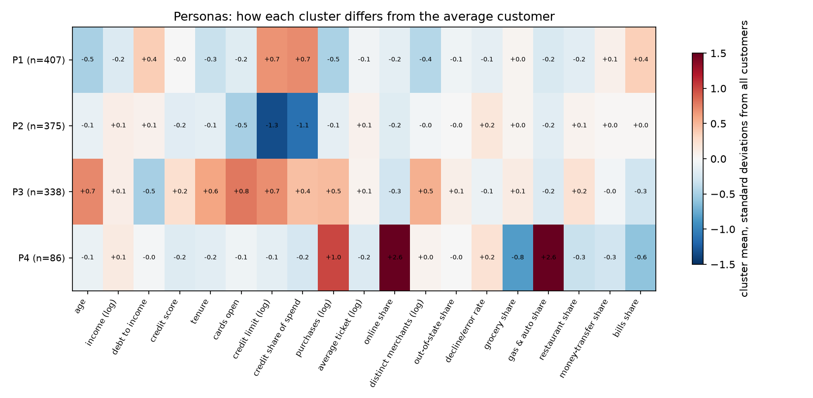

The 1,206 active customers were clustered with k-means on 19 standardised features covering profile, holdings and behaviour.

| Persona | Customers | What sets them apart |
|---|---:|---|
| **Younger credit users** | 407 (34%) | Nearly all hold credit. Median age 44, first card at 29. The lowest income ($37.8k) and the highest debt-to-income (1.62). The lowest spend ($35.6k), 55% of it on credit. |
| **Debit-only everyday spenders** | 375 (31%) | 98% hold no credit card. Otherwise average: age 50, income $41.4k, spend $43.5k. |
| **Established multi-card households** | 338 (28%) | Median age 63, with 37% aged 70+. 17 years' tenure and 4 cards. The highest limits ($17.4k), the least debt (debt-to-income 0.58) and the best credit scores (731). Spend $58.6k across 107 merchants. |
| **Toll-road drivers** | 86 (7%) | 31.5% of their dollars are online toll and bridge payments, about 600 a year each. The most purchases (1,522) and the highest spend ($70.8k). 48% live in the South. |

- **The personas differ little on several things:** gender, region (apart from P4's South tilt), main spend category (groceries for 57–60% of the first three), decline rate and out-of-state spend.
- **The groups are stable but not sharp.** Separation is weak for every number of clusters (silhouette 0.10–0.12). Four is the most detailed solution that stays stable across bootstrap resamples (agreement 0.80).
- **Behaviour on its own doesn't form stable groups.** Only the toll-road drivers and a small money-transfer-heavy group recur.

#### Which segments are worth having: revenue in the first year

**How it's measured:**
- **Customers:** the 282 whose first card opened between January 2010 and November 2018. Their whole first year is observed before the data ends in October 2019.
- **First-year revenue:** months 1–12 from the first-card month, on every card the customer holds. It's interchange net of refunds, with prepaid at the debit rate, plus the Amex fee pro-rated by months open.
- **Missing customers count as $0.** 144 of the 282 have no transactions at all, and the headline counts them as $0. Every figure is also shown among the 138 customers with data.
- **Every cut is tagged by when it's known:**
  - day one, from the cards opened in the first month
  - the February 2020 snapshot
  - at signup
  - a consequence measured years later, such as personas and behaviour

**Each cut is rated three ways:**
- variance explained, net of chance
- a permutation p-value
- how often the order of groups survives resampling

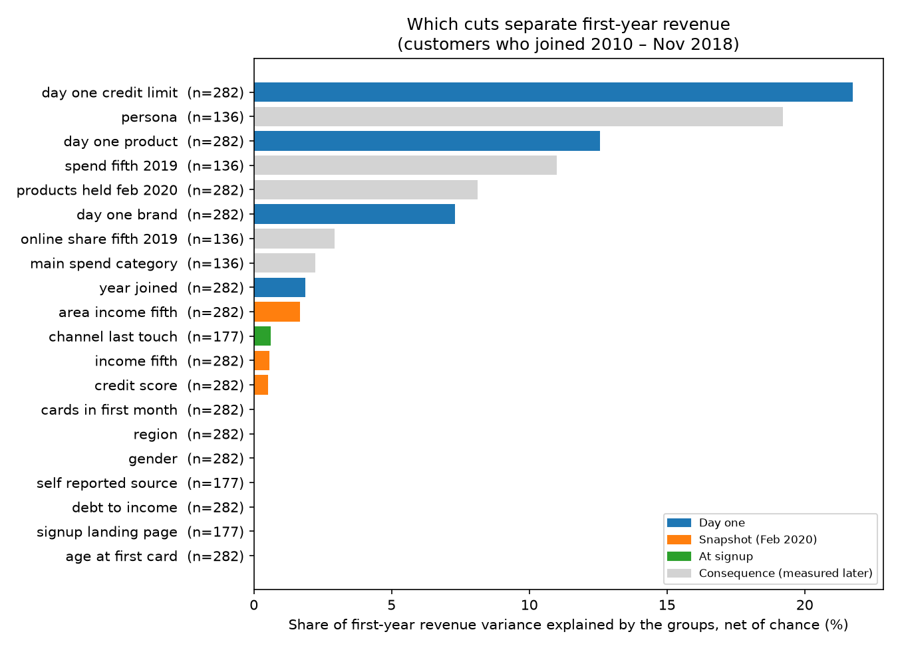

| Cut | When known | Variance explained, net of chance (all customers / with data) | p |
|---|---|---:|---:|
| Highest credit limit on day one | Day one | **21.8%** / 64.0% | 0.001 |
| Product on day one | Day one | **12.6%** / 46.9% | 0.001 |
| Brand on day one | Day one | 7.3% / 26.1% | 0.002 |
| Area income fifth | Snapshot | 1.7% / 4.6% | 0.06 |
| Income fifth | Snapshot | 0.6% / 3.2% | 0.24 |
| Credit score | Snapshot | 0.5% / 8.3% (uneven, not rising) | 0.25 |
| Year joined | Day one | 1.9% / −0.8% (a missing-data effect) | 0.05 |
| Age at first card, region, gender, debt-to-income | Day one / snapshot | about 0% | 0.56–0.84 |
| Source, landing page, last-touch channel (177 customers) | At signup | about 0% | 0.31–0.60 |
| Persona (136 customers) | Consequence | 19.2% | 0.001 |
| Spend fifth, 2019 (136) | Consequence | 11.0% | 0.002 |
| Products held, February 2020 | Consequence | 8.1% / 22.0% | 0.004 |

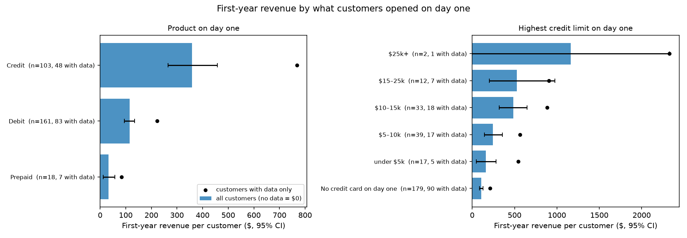

**The product opened on day one is the strongest and most dependable cut.**
- Credit starters earn **$358** in their first year, debit starters **$115** and prepaid starters **$33**. Among customers with data, that's $769, $223 and $84.
- The order holds in every resample.
- Credit starters are 37% of new customers and 66% of first-year revenue.
- The data gap is similar across products (39–52% have data), so counting missing customers as $0 shrinks the gaps without reordering them.

**Among credit starters, a day-one limit of $10k or more is the clearest dividing line.**

| Day-one credit limit | Customers (with data) | First-year revenue | Among customers with data |
|---|---:|---:|---:|
| No credit card | 179 (90) | $107 | $212 |
| Under $5k | 17 (5) | $160 | $543 |
| $5–10k | 39 (17) | $246 | $564 |
| $10–15k | 33 (18) | $483 | $886 |
| $15–25k | 12 (7) | $528 | $905 |
| $25k+ | 2 (1) | $1,163 | $2,325 |

Above $10k, the groups are too small to order reliably: neighbouring bands swap in most resamples.

**Brand only reflects product.**
- Amex earns $489 (20 customers) and Discover $479 (9), because both are credit-only.
- Mastercard earns $168 and Visa $163.
- Within credit, and within debit, brand doesn't separate revenue (p 0.23 and 0.65).

**Once product is known, who the customer is barely matters.**

| Cut | Within credit starters | Within debit-or-prepaid starters |
|---|---|---|
| Income fifth | $274 (bottom) to $576 (top), not significant (p 0.39) | $73 to $141, not significant (p 0.26) |
| Age at first card | no pattern (p 0.62) | no pattern (p 0.06) |
| Credit score | uneven (p 0.24) | uneven (p 0.14) |
| Region | no pattern (p 0.69) | no pattern (p 0.26) |

Higher income points the right way in both products. But with 103 credit and 179 debit-or-prepaid starters, half of them at $0, the difference isn't reliable. Gender (p 0.77) and debt-to-income (p 0.78) show nothing across all customers.

**Acquisition fields don't separate first-year revenue.** For this cohort, the first signup record dates from 2016 or later. So for anyone who joined earlier, the source, landing page and channel describe a later card, not how they first joined.

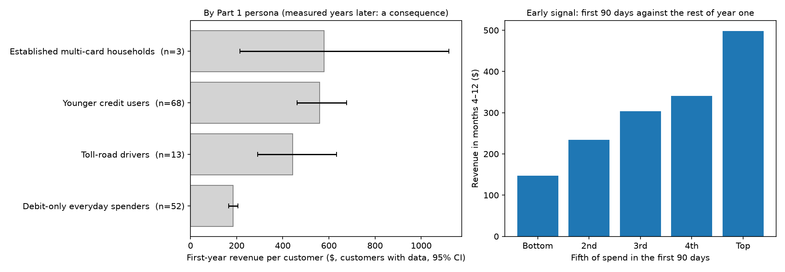

**What separates value most is measured years later, so it describes value rather than predicting it.**

| Consequence cut | First-year revenue, among customers with data |
|---|---|
| Persona | Younger credit users $560 (68 customers); toll-road drivers $444 (13); debit-only spenders $184 (52). Established multi-card households has only 3 customers in this cohort, because it mostly joined before 2010. |
| Spend in 2018–19 | $197 for the bottom fifth to $614 for the top |
| Products held, February 2020 | credit only $690; debit only $211 |

**The first 90 days are the best early signal.** This uses the 138 customers with data.
- **First-90-days revenue predicts revenue in months 4–12 almost perfectly** (Spearman 0.93).
- **First-90-days spend predicts it strongly within each product:** 0.91 for credit and 0.71 for debit or prepaid.
- **By fifth of first-90-days spend, revenue in months 4–12 rises steadily:** $147, $235, $304, $341, $498.

**Leading indicators versus consequences:**
- The product and limit on day one are known at acquisition and predict first-year value.
- First-90-days revenue is known three months in and predicts the rest of the year.
- Personas, spend today and products held today separate value strongly, but only because they're measured after the fact. They can't be used to choose customers.

Two caveats on the leading indicators:
- **The "day-one" limit is the limit in the extract.** `cards_data` holds one limit per card and no history, so the report assumes it was set when the card opened.
  - That mostly fits: limit relative to income barely changes with card age (0.22–0.26 of income across age bands; rank correlation 0.14).
  - But among the 515 customers with credit cards opened at different times, the earliest card has the higher limit about 60% of the time, against 50% by chance. That could be later limit increases, or second cards simply being issued with lower limits.
  - If some limits were raised for good customers, part of the limit's predictive power is a consequence, not a signal at acquisition. A limit history from the card platform would settle it.
- **The 90-day signal is flattered by this data.** Spending here barely changes over time (near-daily purchases, no seasonality), so a customer's first three months look almost exactly like the rest of their year. In real data the early signal is likely weaker. The 90-day milestone should be re-tested once recent customers' transactions are available.

#### Spend isn't revenue

What a customer is worth to us is the revenue we earn on their spending. That depends on which card the money goes through, not how much is spent. On Finance's rate card, a dollar on credit earns 1.8%. A dollar on debit earns 0.05% plus 21 cents per purchase, about 0.5% on a typical $48 purchase.

Twelve months of spend and rate-card revenue for the 1,206 active customers (November 2018 – October 2019), priced like the three-year values:

| Persona | Median spend | Median revenue | Revenue per $100 of spend | Median share of spend on credit |
|---|---:|---:|---:|---:|
| Younger credit users | $35.6k | $486 | $1.33 | 55% |
| Established multi-card households | $58.6k | $676 | $1.20 | 53% |
| Toll-road drivers | $70.8k | $554 | $0.94 | 41% |
| Debit-only everyday spenders | $43.5k | $217 | $0.48 | 0% |

- **The lowest spenders earn us more than bigger spenders.** Younger credit users spend the least of any persona, yet earn us more than twice as much per customer as debit-only spenders, who spend more.
- **The biggest spenders aren't the most valuable.** Toll-road drivers spend the most but rank third on revenue, because less of their spend goes on credit.
- **Where the money goes matters more than how much.** Customers who put everything on credit spend less than those who put nothing on credit ($39.5k against $45.1k), but earn us almost three times as much ($652 against $229).
- **Spend and revenue line up only loosely:** customers rank 0.61 alike on the two, on a scale where 1 is a perfect match.

So spend is the wrong yardstick for "worth having", and the product a customer starts on is the right one.

#### Weak points of the revenue model

The model is interchange from Finance's rate card plus the Amex fee. Four gaps matter, and the three-year table in Key numbers puts numbers on the first two:
- **No rewards, credit losses, funding or servicing costs.** These fall mostly on credit, so they are the biggest threat to the ranking. Credit's lead over debit holds only while rewards and losses stay under about **1.1% of credit spend for Core and 1.4% for Premium**. This is the figure Finance should confirm before the segment ranking drives spend.
- **No revolving interest in the headline,** because there is no balance data. Finance's own assumption (35% of balances revolve at 19.99%), applied to a balance of one month's credit spend, adds about a third to credit revenue: +$845 over three years for a Premium customer against +$45 for Debit. It widens credit's lead and raises the cost break-evens to 1.7% and 2.0%.
- **Prepaid isn't on the rate card.** It is priced at the debit rate here; Q4 uses $0 instead. Prepaid is under 10% of every channel's mix, so the choice doesn't move any conclusion.
- **Credit interchange is one blended rate.** Finance's 1.8% is "blended across MCCs". Real interchange varies by merchant type and by card tier, and premium cards usually earn more. Premium's lead could be understated or overstated; the data can't tell which.

Money transfers are charged at the full credit rate, and every value is conditional on the customer still being on file in February 2020.

**What this means for acquisition.** Channels bring nearly the same mix (Q3), so segment value doesn't decide which channel to fund. It decides what we put in front of applicants: lead with credit.

#### What this cannot answer — and what to instrument

The segment ranking rests on gross revenue for the customers we can see. Turning it into a profit ranking, and extending it to recent customers, needs:
1. **Rewards, credit-loss and funding cost per card, from Finance.** This is the biggest open question: credit's lead over debit disappears once those costs pass about 1.1–1.4% of credit spend.
2. **Statement balances by card and month,** to replace the assumed one-month balance behind the revolving-interest figures.
3. **Credit-limit history,** to confirm the day-one limit was set at opening and not raised later.
4. **Income and credit score at application,** not the February 2020 snapshot, so owner attributes can be tested as true day-one signals.
5. **Transactions for every customer.** 144 of the 282 customers in the value cohort have none, and nobody whose first card opened after October 2017 does, so recent cohorts can't be valued at all.
6. **Interchange by merchant type and card tier,** in place of Finance's single blended credit rate.

### 2. When does a new customer become a *real* customer — and when do I know I'm losing one?

Marketing counts an approved application. Finance counts the first transaction. Neither is enough on its own. The quiet-loss detail and backup tables are in [`QUIET_LOSS.md`](active_ds_takehome_handout/analysis/q2_quiet_loss/QUIET_LOSS.md).

#### Neither existing clock is right

- **Marketing (approved application).** `account_signups` has 1,588 rows for 994 customers. About half of signup records are existing customers adding a card, and the January–February 2020 volume surge looks like a recording artifact. Counting apps as customers overstates acquisition.
- **Finance (first settled purchase).** Better — money moved — but still thin. One purchase is activation, not proof of habit or value.
- **Coverage blocks a clean comparison on recent new customers.** Of 441 new customers with a signup record, only 9 have any transactions: almost all recent joiners fall after the transaction file ends (October 2019). So today's acquisition cannot be scored on first purchase in this extract.

#### When they become "real"

Use two stages, and keep Q1's day-one product as the value cut:

| Stage | Definition | Why |
|---|---|---|
| **Activated** | First settled purchase | Finance's bar — necessary |
| **Real** | Sustained use and meaningful revenue by ~day 90 | Q1: first-90-day revenue predicts months 4–12 almost perfectly (Spearman 0.93); day-one credit vs debit vs prepaid still sets how valuable they are |

Among the 1,206 customers with purchases in November 2018 – October 2019, behaviour is near-daily (median gap of 1 day; 99.6% buy in every month). So in the **observed** base, first transaction and "real" nearly collapse: there is almost no one-and-done population to separate the two clocks. That is a data limitation, not evidence that Finance's definition is sufficient for acquisition reporting. For budget decisions, celebrate early habit and early revenue by segment — not approvals, and not a single swipe.

#### When they're quietly going away

Quiet loss is defined at the **customer** level (cards expire; spend moves to other cards). On the same 1,206 actives, by Q1 day-one segment:

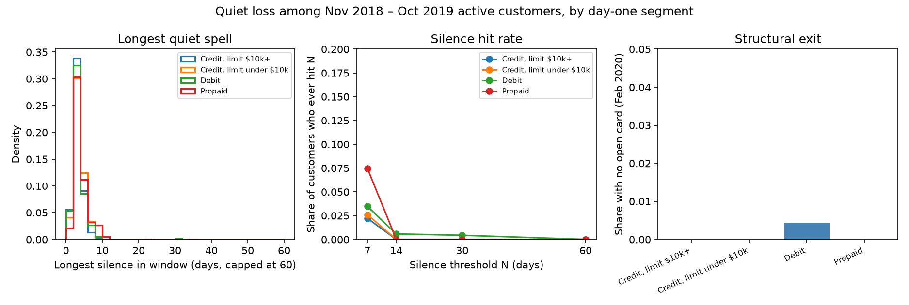

| Day-one segment | Customers | Median gap (days) | Ever silent ≥7 days | Ever silent ≥14 days | Ever silent ≥30 days | No open card (Feb 2020) |
|---|---:|---:|---:|---:|---:|---:|
| Credit, limit $10k+ | 226 | 1 | 2.2% | 0% | 0% | 0% |
| Credit, limit under $10k | 193 | 1 | 2.6% | 0% | 0% | 0% |
| Debit | 693 | 1 | 3.5% | 0.6% | 0.4% | 0.4% |
| Prepaid | 94 | 1 | 7.4% | 0% | 0% | 0% |
| **All active** | **1,206** | **1** | **3.4%** | **0.3%** | **0.2%** | **0.2%** |

- **At risk:** **7 days** without a settled purchase. It is already unusual: about 3% of actives ever hit it. Prepaid is slightly more exposed (7.4%), and credit starters almost never go quiet for a week.
- **Likely gone:** **no open card**, or about **30 days** silent. In this window that is three debit day-one customers, the same three people on both definitions.
- **What the flag is worth.** It would have flagged 41 customers. 38 came back within 30 days on their own; the other 3 are the only customers who left, and all three left because their cards ran out. It catches every loss here, but most alerts are false alarms, and three losses are far too few to tune the threshold. Treat it as a monitoring flag to calibrate once closures are recorded, not as a tested churn predictor.
- **Don't use a 60-day recency rule** (the usual "60 days without a purchase" cut-off) on this base: nobody reaches it.

Segments barely differ on quiet loss among people we can see. The Q1 value split (credit vs debit vs prepaid) is about revenue, not about who fades.

#### What this cannot answer — and what to instrument

- The ~394 customers who joined before November 2019 with no transaction rows are out of scope: missing history vs never-activated cannot be separated here.
- `users_data` only includes people still on file in February 2020, so departures before then are invisible. These rates are not historical portfolio churn.
- Near-daily purchasing may partly reflect how this public dataset was built; the actionable finding is the **relative** one (short gaps, rare silence).

To answer Q2 properly in production: account-closed and charge-off flags; an activation timestamp that matches first spend; transaction coverage for customers acquired after October 2017; and a logged "real customer" milestone (e.g. N active weeks or first-90-day revenue above a segment floor) alongside Marketing's and Finance's clocks.

### 3. Which channels bring good segments vs tyre-kickers — and next year's budget?

Full write-up: [`CHANNEL_QUALITY.md`](active_ds_takehome_handout/analysis/hypotheses/CHANNEL_QUALITY.md). Belief-level evidence: [`VP_BELIEFS.md`](active_ds_takehome_handout/analysis/hypotheses/VP_BELIEFS.md).

**Short answer:** no paid channel is a tyre-kicker factory. Channels separate on **cost**, not on day-one mix. Next year's budget should follow our own cost per new customer, not platform CAC. The cheapest channel (branded search) should be held rather than scaled, and affiliate shouldn't be scaled until commissions are visible.


#### How "good" and cost are measured

- **Good segment:** day-one **Premium credit** (highest limit ≥ $10k) or Core credit. **Tyre-kicker:** prepaid. Same rule as Q1 Part 2 and Q2. The ideal definition would be "never becomes a real customer" (Q2), but 2020 joiners have no transactions, so the card they opened is the only signal available.
- **Quality:** each new customer's day-one segment, credited linearly across channels in their journey, priced at the three-year values in Key numbers (Premium $2,760 / Core $1,601 / Debit $793 / Prepaid $330, among customers with data). This is priced quality, not observed lifetime value.
- **Our CAC:** Jan–Feb 2020 spend ÷ new customers credited (linear). Existing customers' extra cards excluded. Only this window is usable (56 new customers recorded before 2020).
- **Joins:** spend ↔ touches on date/channel/campaign; touches ↔ next signup on `client_id` (all linked touches within 45 days before signup).

**CAC by attribution rule, Jan–Feb 2020:**

| Channel | Last touch | First touch | **Linear (headline)** | Any touch |
|---|---:|---:|---:|---:|
| Google branded search | $470 | $1,644 | **$699** | $262 |
| Microsoft Ads | $4,712 | $1,368 | **$2,197** | $477 |
| Meta | $4,593 | $2,296 | **$2,605** | $705 |
| Google non-brand search | $5,169 | $1,973 | **$2,937** | $696 |
| Reddit | $5,654 | $2,609 | **$3,251** | $707 |
| Apple Search Ads | $55,703 (1 customer) | $2,653 | **$8,404** | $1,688 |

On linear credit, brand is cheapest in 100% of 4,000 resamples, Microsoft second in 87%, and Apple most expensive in 100%. On first touch, Microsoft is cheapest at $1,368 (95% range $1,010–$2,020), but its range overlaps brand's ($1,644; $1,281–$2,291), so the two are effectively level at starting journeys.

The same order holds on the 56 new customers from 2016–2019: brand cheapest, then Microsoft, then Meta. Those costs run to $83k+ per customer, which says the older sign-up records are incomplete rather than that acquisition was that expensive.

#### Quality barely moves; efficiency does

- **Prepaid share is ~8–10% on every paid channel.** Affiliate is slightly worse at 13%. Expected three-year value by channel sits in a tight band (~$1.3–1.8k).
- **Apple and Reddit look richer on mix** (Apple 45% Premium, 0% prepaid), but on only ~7–11 linear customers. That isn't a basis to shift budget toward them.
- **Value per CAC dollar** is the separator: brand **$1.86**, Microsoft $0.58, Meta $0.53, Reddit $0.50, non-brand $0.43, Apple **$0.22**. This is gross revenue before rewards and losses. If the customers with no transaction data are genuinely inactive, every figure roughly halves (brand $1.02); the order doesn't change.

#### Next year's budget

Shares are of January–February 2020 paid spend.
1. **Don't set budget from platform-reported CAC.**
2. **Google branded search (16%): hold, don't scale.** It is the cheapest on our records, but three things argue against scaling it:
   - In Q4, doubling it for two weeks bought clicks and no measurable accounts.
   - It finishes journeys other channels start: it is the last touch for 161 new customers and the first for 46, and the next touch after an affiliate is branded search 97 times.
   - Its volume is capped by people already searching for us.
3. **Microsoft (9%): test growing it.** It is second-cheapest on linear credit and level with brand at starting journeys.
4. **Meta (31%): hold and test with a holdout.** It is the largest line, at a middling cost.
5. **Google non-brand (24%) and Reddit (7%): trim or test.** They have the lowest returns after Apple.
6. **Apple (12%): don't grow; pause-test before cutting.** It opens journeys others close. Also fix the triplicated spend rows.
7. **Affiliate: load commissions into spend; pay on new customers only; grow partners only once their cost beats brand's.**
8. **Move money in steps, each with a holdout.** Every channel's share of spend moved by under a percentage point from 2016 to 2019, so the data can't show what an extra dollar buys in any channel. Attribution ranks exposure, not lift.

The log of ad and site visits that attribution rests on doesn't rise and fall with spend in any channel (Q4: correlation −0.12 to +0.03). That is a further reason to read these costs as a ranking, not a price list.

#### The VP's three beliefs (evidence behind the budget)

**Belief 1 — "Microsoft is most efficient at ~$770": the number is wrong, but the instinct is partly right.**

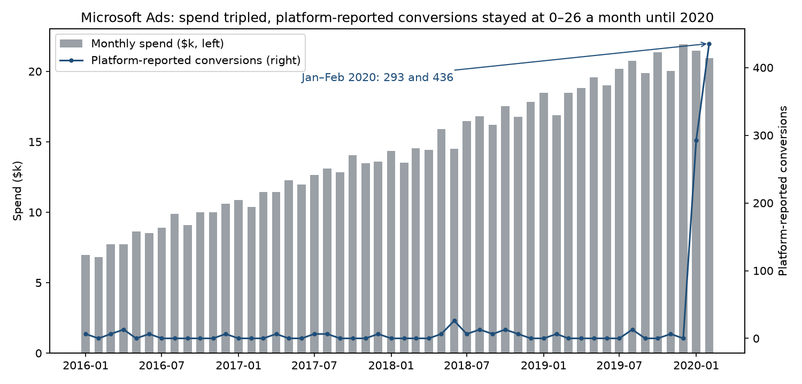

- The $770 is Microsoft spend ÷ Microsoft's own conversion count.
- That count never exceeded 26/month in 2016–2019, then jumped to 293 and 436 in Jan–Feb 2020 with spend flat — creating the $770. Without those months, platform cost per conversion is about $4,000.
- Microsoft claims 728 conversions in those two months — more than our 385 new customers from every channel, and over 3× the 220 signups Microsoft touched.
- On our records: **~$2,200** per new customer, second to brand at $699. It supports journeys more than it closes them (23% of journeys, last touch for only 9).
- On first touch it is the cheapest channel (~$1,370), level with brand within the uncertainty. So Microsoft is a good channel, just not at $770, and it's the natural one to test growing.

**Belief 2 — "Apple is a money pit; spend keeps climbing": partly right.**

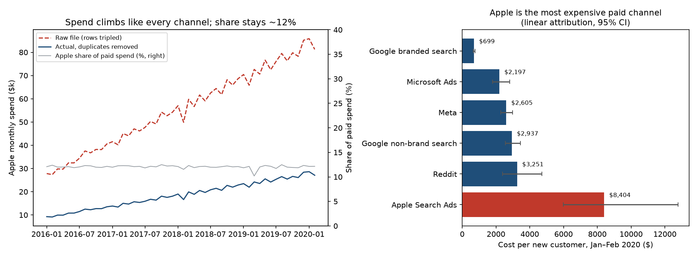

- Return is poor (**~$8,400** CAC; last touch for 1 new customer). Share of paid spend stayed ~10–12.5% every month — spend climbs with the whole budget, not Apple alone.
- Raw file triple-counts Apple ($2.78M vs $0.93M).
- On first-touch credit Apple is ~$2,650 (in line with Meta/Reddit); it opens journeys a median of 18 days before signup. Pause-test rather than cut cold.

**Belief 3 — "Affiliate is free growth, scale hard": wrong as stated.**

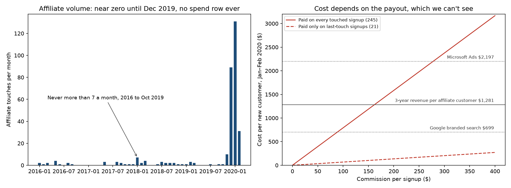

- No affiliate rows in `channel_spend`. All 319 affiliate touches belong to people who signed up (looks like a partner conversion feed).
- Of 245 affiliate-touched signups in Jan–Feb 2020, **123 were existing customers** adding a card. Affiliates start journeys; brand finishes them.
- Expected 3yr value ~$1,269 on linear credit (~$1,281 for any affiliate-touched new customer) vs ~$1,365 for others. If paid on every touched sign-up, commissions above **~$160** exceed that revenue (before costs).

#### What this cannot answer — and what to instrument

The order of channels holds up; the dollar amounts and each channel's true incremental effect don't. Setting budget on measured numbers needs:
1. **Holdout tests by channel.** Switch a channel off, or raise it, in matched regions and compare new customers. It is the only way to see what a channel adds; attribution can't show it.
2. **Click IDs and paid-traffic logging,** for example `gclid` stored at landing and joined to the sign-up. Today's visit log doesn't rise and fall with spend, so attribution rests on it only loosely.
3. **Affiliate commissions by partner and month** in `channel_spend`, paid on new customers only.
4. **Real campaign-level spend.** Each channel's spend is split equally across its campaigns every day, so campaigns can't be compared.
5. **Each platform's conversion definition,** starting with Microsoft's, whose count jumped in January 2020 past our new customers from every channel combined.
6. **Complete sign-up records before 2020.** Only 56 new customers are recorded across 2016–2019, so costs can only be measured on two months.
7. **Transactions for 2020 joiners,** so channel quality can be measured from real spending rather than estimated from the card each customer opened.

### 4. What was the incremental impact of the March 2019 brand campaign?

**Short answer:** the campaign bought much more brand search exposure, but there's no measurable incremental account or transaction behind it.

| Outcome | Estimate |
|---|---:|
| Accounts | −2 |
| Settled purchases | +1.8%, within what ordinary weeks show once the baseline is checked |
| Interchange | +$519 |

The likely sources of the CMO's claim are the March sign-up count (13, against about 8 in a typical month) and the platform's click numbers. Neither shows lift.

**What "the campaign" is.**
- **Campaign labels can't identify it.** In `channel_spend.csv` every campaign within a channel is an identical split of the channel's spend and runs every day from 2016 to 2020. `spring_launch` is a Meta label that runs all year. The campaign can therefore only be defined as a burst of channel spend on particular dates.
- **There is only one such burst in 50 months.** Brand search and Meta both doubled on March 4–15, 2019, reaching 2.0× their trailing eight-week average. No other week in any channel from 2016 to February 2020 exceeds 1.18×.
- **The analysis uses three periods of exactly two Monday–Sunday weeks each:**
  - pre: February 18 – March 3
  - campaign: March 4–17
  - post: March 18–31

  The spend burst ends on March 15, so the campaign period includes two normal days.
- **Extra spend during the campaign:**
  - brand search: $13,574
  - Meta: $25,925
  - total: $39,499

  Both were back to normal in the post period (−$135 and −$1,139).

**Method: two difference-in-differences comparisons, because the outcomes are recorded at different levels.**

1. **Brand search against control channels, on the same days.** This covers what is recorded by channel: spend, impressions, clicks and site touches.
   - The controls are non-brand search, Apple, Microsoft and Reddit.
   - Meta is excluded because it surged on the same days, so any effect is a joint brand-plus-Meta effect.
   - The estimate is the change in the log gap between brand and the average control. It is identical to a regression with channel and day fixed effects, which a test confirms.
2. **2019 against 2018, for accounts and transactions.** These have no channel dimension, so other channels can't stand in for them. The estimate is the 2019 change from pre to campaign, minus the same change over the same weekdays 364 days earlier.

**How the results are judged: placebo tests.** Each design is rerun on every other six-week window that doesn't overlap the campaign:
- 80 windows for the channel comparison
- 27 for transactions
- 36 for accounts

The p-value is the share of placebo estimates at least as large as the real one. Control channels are also treated, one at a time, as if they were the campaign.

| Outcome | Comparison | Effect in campaign period | How unusual |
|---|---|---:|---|
| Brand spend | Channels | +85% | p = 0.01 (no placebo window comes close) |
| Brand clicks | Channels | +81% | p = 0.01 |
| Brand site touches | Channels | +2.3% | p = 0.49; placebo 90% range −3.7% to +4.7% |
| Accounts opened | 2019 vs 2018 | −2 (2019: 7 → 6; 2018: 4 → 5) | 90% interval −10 to +6; p = 0.59 |
| Settled purchases | 2019 vs 2018 | +1.8% (+883) | p = 0.07 |
| Purchase dollars | 2019 vs 2018 | +2.4% (+$59.8k) | p = 0.21 |
| Interchange | 2019 vs 2018 | +2.1% (+$519) | p = 0.46 |

Nothing carries into the post period:
- touches −1.6%
- accounts −2
- purchases +0.9%
- interchange −$263

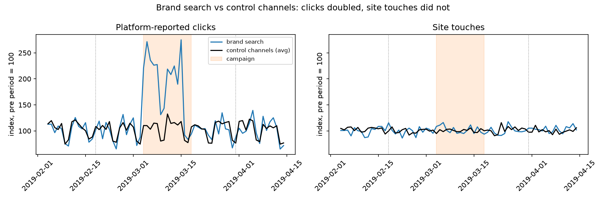

**The ads ran, and site traffic didn't respond.**
- **Brand clicks were well above the controls:** +101% in the first campaign week and +63% in the second, back to baseline the week after. In the six weeks before, the weekly gap stayed between −4% and +6%, so brand and the controls moved in parallel beforehand.
- **Site touches rose by about 5 a day, against about 3,300 extra platform clicks a day.** Placebo windows suggest we would have detected a lift of about 8% or more.
- **The result doesn't depend on the choice of controls:**
  - dropping Microsoft gives +0.8%
  - treating a control channel as if it were the campaign gives between −5.6% and +3.2%
- **Touches don't follow spend in any channel.** The correlation is between −0.12 and +0.03 across 2018–2019, so the touch log may not capture paid traffic at all. Flat touches are uninformative rather than proof of no effect.

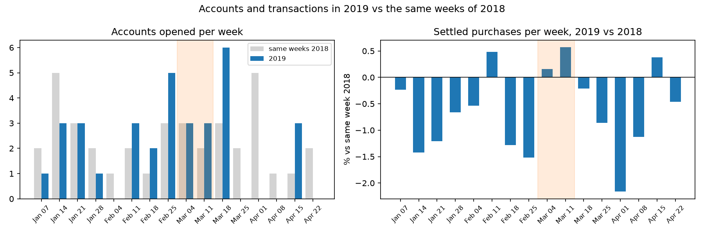

**Accounts: no detectable lift, and the March bump is offset by April.**
- **Counts:** the campaign weeks had 6 accounts, against 7 in the two weeks before. The same weeks of 2018 went from 4 to 5.
- **Signup timestamps can't be trusted at the day level.** A card's first transaction is on the 1st of its open month at the median, while signup times are spread evenly across the month. 94% of cards transact before their own signup timestamp.
- **So I also compared calendar months:**
  - March 2019 (13 accounts) is +5.6 against 2018's pattern.
  - April 2019 (3 accounts) is −6.5.
  - Together that's about −1 over March–April. That looks like timing moving between months, not new demand.
- **All 13 March accounts were existing customers adding a card.** No new customer joined in March 2019 at all.
- **The data can only detect a large lift:** about 14 extra accounts in two weeks, roughly tripling the normal rate. So it can't rule out a modest lift; the top of the range is about 6 extra accounts.

**Transactions: a borderline count that doesn't hold up.** Settled purchases rose 1.8% (p = 0.07), but:
- **The 2019 pre period was soft.** The weeks of February 18 and 25 were 1.3% and 1.5% below 2018. The campaign weeks were +0.2% and +0.6%, no better than the weeks of February 11 (+0.5%) and April 15 (+0.4%).
- **Against a January–February baseline, March's lift is only +0.5%.**
- **82% of it (+727 of +883) is on cards more than a month old.** That's existing usage, which a brand search ad wouldn't plausibly move. The cards opened in March added about 156 purchases, worth about $53 of interchange.
- **Interchange shows nothing:** +$519, p = 0.46.

Even at the top of the range, the campaign added at most about 1,650 purchases and $1.5k of interchange over the two weeks. That is about 11 cents per dollar of extra brand spend, or 4 cents per dollar once Meta's extra spend is included. These bounds cover the two campaign weeks only. Any extra account would keep earning afterwards, and this answer doesn't put a value on that.

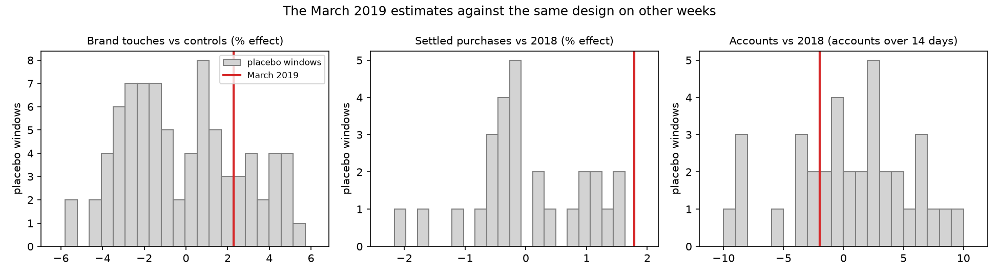

**The platform doesn't claim the conversions either.** Brand search reported 1, 0 and 1 conversions in the pre, campaign and post periods.

**What I'd tell the CMO:** "We doubled brand search and Meta for two weeks. It bought clicks. We can't see that it bought accounts or transactions, and the account bump in March was given back in April."

**What I'd instrument to measure the next one:**
1. **A geo holdout.** Go dark, or double spend, in matched regions and compare accounts and transactions by region. `users_data` has addresses, so this is possible.
2. **Click IDs** (for example `gclid`) stored at landing and joined to the signup, so paid clicks link to accounts. Touch logging that actually records paid traffic.
3. **Real application and activation timestamps,** to replace signup times that disagree with card activity.
4. **A transaction extract that includes customers acquired after October 2017.** None of them appear in the current file.

## Assumptions and limitations

**Data**

1. **Apple spend** de-triplicated by keeping one spend/impression/click row per date×campaign and max(conversions) across copies.
2. **Platform CAC is not our CAC.** `platform_reported_conversions` is each ad platform's own claim. Our CAC uses attribution against `account_signups` (see the channel assumptions below).
3. **Self-reported source** is a survey field, not paid-channel attribution.
4. **Fraud labels were not examined.** The brief marks `train_fraud_labels.json` as optional, so no segment or channel figure is adjusted for fraud.

**Customer profile (Q1, descriptive part)**

- **Populations and definitions.**
  - Attributes cover all 2,000 customers, from the February 2020 snapshot. Every age in the file matches that month.
  - Behaviour covers the 1,206 customers with a settled purchase from November 2018 to October 2019.
  - A **settled purchase** has a positive amount and no error. A **refund** is a negative amount with no error. A **decline** is any row with an error.
- **Holdings are the cards open in February 2020:** opened by then and not yet expired. Cards stop transacting at expiry: for 98% of expired cards, the last transaction is within two months of the expiry date.
- **Location.**
  - The state comes from each customer's coordinates, using an offline nearest-place lookup (`reverse_geocoder`, GeoNames data).
  - It matches the customer's main in-person merchant state for 99.6% of customers. One customer near the Mexican border can't be placed.
  - Out-of-state spend compares in-person merchants with that state. "Abroad" means the merchant state field holds a country name.
  - Online purchases carry no merchant location, so they're excluded from both measures.
- **Merchant categories.** The 109 merchant codes are grouped by hand into 11 categories. Codes 3000–3999, which `mcc_codes.json` labels as manufacturing (in standard coding they're airline, hotel and car-rental codes), are kept as "industrial (as labelled)" rather than reassigned.
- **Field caveats.**
  - **Income** is a snapshot, and it is mostly derived from area income.
  - **`num_credit_cards`** counts every card.
  - **The `credit_limit` field on debit and prepaid cards** isn't a credit line: the medians are $16.5k and $65.
  - **`card_on_dark_web`** is "No" for every card.
  - **Credit scores clump:** 193 sit at 680–689, against 54 at 670–679, and 34 at 850.
- **Coverage.** 781 customers have no transactions. 387 of them joined after the data ends, and the other 394 are mostly young and recent. No customer whose first card opened after October 2017 has any transactions. Behaviour therefore describes long-standing customers only.
- **Personas: how the clusters were built.**
  - The method is k-means on 19 standardised features of active customers, for 2 to 8 clusters, each scored on separation (silhouette) and stability. Stability is the adjusted Rand index against refits on 20 bootstrap resamples.
  - **The cluster-count rule was changed after seeing the results.** Separation is low (0.10–0.12) for every count. The first rule, which picked by separation, chose three clusters. The final rule takes the most detailed solution with stability of at least 0.8 and no cluster under 50, which gives four.
- **Several patterns look simulated:**
  - near-daily purchasing by every active customer
  - no seasonality or weekday pattern
  - near-even splits of landing pages and devices

  They limit how much behaviour can tell customers apart.

**Segment value (Q1, first-year revenue)**

- **First year.**
  - It covers months 1–12 from the customer's first-card month, which is known only to the month.
  - It includes every card the customer holds in that period, not just the first one.
  - Only customers whose first card opened by November 2018 are included, so the whole year is observed.
- **Revenue model.** This is the model settled for Q1:
  - interchange at the Finance rate card, net of refunds and reversals; each refund also cancels one debit per-purchase fee
  - prepaid at the debit rate, since the rate card doesn't cover it
  - money transfers at the full rate, since the credit rate is "blended across MCCs"
  - the Amex $95 fee pro-rated by months open, stopping at expiry
  - **no revolving interest and no costs in the headline.** There's no balance data, so interest is a sensitivity only: Finance's 35% revolving share at 19.99% APR, on a balance assumed to be one month of credit spend. Costs are a sensitivity grid of 0–1.5% of credit spend for rewards and losses. Both are in the three-year table in Key numbers.
- **Refunds are large.** Negative amounts are 10.6% of purchase dollars. 65% exactly cancel an earlier purchase on the same card and merchant, and 88% are at service stations and food stores. That looks like released pre-authorisation holds and returns, so netting them off is the base case.
- **Customers with no transaction data count as $0 in the headline.** That's 144 of 282, including every 2018 joiner.
  - It's a deliberate choice, but these customers look like missing data rather than inactive accounts.
  - It halves every value and shrinks every separation.
  - It creates a false decline by year joined.
  - Values among customers with data are shown throughout.
- **Owner attributes are February 2020 values,** not values at application. That covers income, credit score, region and debt.
- **Credit limits are recorded once per card, with no history.** The day-one limit is assumed to be the limit at opening. The check behind that assumption, and its limits, is under "Leading indicators versus consequences" in Findings §1.
- **Acquisition fields come from the customer's first signup record,** which only exists from 2016 onward.
- **Consequence cuts are rated only on customers with data.** These are personas, spend, online share and spending mix, all measured November 2018 – October 2019.
- **The samples are small.** 282 customers, 138 with data, 48 credit starters with data, and 2 with a day-one limit of $25k or more.
- **Values are conditional on staying.** The customer file only includes people who were still customers in February 2020.

**Activation and quiet loss (Q2)**

- **Population for quiet loss:** the 1,206 customers with a settled purchase from November 2018 to October 2019. Gaps are between calendar days with a first settled purchase that day.
- **Day-one segments** match Q1: cards opened in the customer's first-card month; credit split at a $10k highest day-one limit; else debit or prepaid.
- **"Real customer"** is defined as early habit / first-90-day revenue, reusing Q1's early-signal result rather than a separate activation ladder on recent cohorts (almost none of whom have transactions).
- **Silence hit:** an inter-purchase gap ≥ N days, or terminal silence to the window end ≥ N. Return after an alert is evaluated only on inter-purchase episodes (next purchase within N + 30 days); terminal silence is reported separately.
- **Structural exit:** no card with `open_idx` ≤ February 2020 and `expires_idx` ≥ February 2020.
- **Out of scope:** the ~394 customers who joined before November 2019 with no transaction rows; customers who left before the February 2020 snapshot; cards opened after the transaction window, which have no history.
- **Near-daily use** in the active base may partly be a property of the public dataset. The operational recommendation (short silence bars) follows from the observed gap distribution, not from a fitted churn model.

**Channel quality and budget (Q3)**

- **Good vs tyre-kicker** uses day-one Premium (highest credit limit ≥ $10k) / Core credit / Debit / Prepaid, the same rule as Q1 Part 2 and Q2.
- **Quality is priced, not observed** for 2020 new customers (no transaction rows). Mix × segment values indicates segment quality; it doesn't measure lifetime value.
- **Three-year segment values** come from customers whose first card opened January 2010 – November 2016, priced with Q1's revenue model (prepaid at the debit rate, Amex fee included).
  - The headline uses customers with transaction data; Key numbers also shows the version with no-data customers at $0.
  - Debit and prepaid run about 4% above Q1's first-year table, because this pipeline doesn't reverse the per-purchase debit fee on refunds.
- **Value per CAC dollar** is gross expected three-year revenue before rewards, credit losses and servicing. So channels below 1× are not proven loss-making over a longer horizon, or at a lower CAC under other attribution rules.
- **The visit log doesn't follow spend.** Across 2018–2019 the correlation between a channel's spend and its logged touches is −0.12 to +0.03 (see Q4). Attribution built on those touches shows which channels customers passed through, not which drove the sign-up.
- **New customer:** the customer's first signup, in the month their first card opened.
  - Other cards in that month count as "new customer, extra card".
  - All later cards count as existing customers' cards.
  - Customer-level CAC excludes both kinds of extra card.
- **Attribution is by observed journey, not causation.**
  - Touches are assigned to the customer's next signup by `client_id`.
  - Linear credit is the headline. Last, first and any-touch credit are shown as sensitivity.
- **Only January–February 2020 gives usable costs.** That is 385 new customers, during an unexplained surge in signups. Spend is matched to the same two months; matching it to when journeys began (mid-November 2019) raises costs by about 1.7×.
- **Touches are not clicks.** At most 0.55% of paid touches link to a customer. Unpaid channels (affiliate, organic, referral) log only people who signed up, so their link rate is 100% and tells us nothing about conversion.
- **A tagging outage in June 2019** logged paid touches as direct (direct rose to 20,656 that month). It falls outside the costed window.
- **Campaigns can't be separated.** Within each channel, spend is split exactly equally across campaigns every day.
- **Platform-reported conversions jump on every platform in January 2020.** Microsoft's 728 exceed the 385 new customers from all channels combined, so its count is treated as unreliable.
- **Affiliate commissions are not in the data.** The commission scenarios are illustrative, and break-even compares commission with revenue, not profit.
- **Affiliate / channel customer value** prices day-one card type at the three-year values: Premium $2,760, Core $1,601, Debit $793, Prepaid $330.

**March 2019 brand campaign (Q4)**

- **Clean spend table.** Q4 uses `clean_channel_spend.csv`, one row per channel per day. Apple's triplicate copies are counted once, and the platform's conversion credit is kept wherever it sits among the copies. The campaign is defined by dates, because campaign labels are identical splits of their channel's spend.
- **The effect is joint with Meta.** Meta's spend doubled on the same days, so nothing here can separate brand search from Meta. Cost is shown for brand search alone and for both together.
- **Analysis window.** Counts and baselines use data from January 2018 onward, so 2018 is the only comparison year. Whether a customer counts as new or existing still uses their full card history.
- **The placebo windows overlap one another,** so the p-values are approximate. With 27–80 placebo windows, the smallest possible p-value is 0.01–0.04.
- **Signup timestamps don't match card activity within the month.** 94% of cards transact before their signup timestamp, and the first transaction is on the 1st of the open month at the median. That makes day-level account windows uncertain, so I also checked calendar months.
- **No customer acquired after October 22, 2017 appears in `transactions_data.csv`.** Transactions from new customers can't be measured. All of the transaction results are for existing customers.
- **Touchpoints are unreliable for this question:**
  - They don't follow spend in any channel.
  - A tagging outage from June 3 to 23, 2019 logged all paid touches as direct.
  - Only 0.6% of touches link to a customer, and only to customers who later signed up.

  So touches can't confirm or rule out traffic lift.
- **Interchange** is calculated on settled purchases before refunds: credit 180 bps; debit 5 bps plus $0.21 per purchase; prepaid $0, since the rate card doesn't cover it. (Q1's first-year model prices prepaid at the debit rate; Q4 uses $0 so campaign interchange is not inflated by an assumed prepaid rate.)
- **Upper bounds are the top of a 90% range.** For accounts, the range comes from a Poisson standard error on the four period counts. For purchases and interchange, it's the estimate plus 1.645 placebo standard deviations, applied to the level the period would have had without the campaign. The bounds cover the campaign weeks only and don't value what an extra account earns afterwards.
- **Easter** fell on April 1, 2018, inside the 2018 comparison for the post period. Day-level checks show no holiday effect outside Christmas and New Year.

## How to run

```bash
# setup
python3 -m venv .venv
.venv/bin/pip install -r requirements.txt

# data: put the nine handout files in active_ds_takehome_handout/
# (transactions_data.csv is not committed: it is 1.2GB and listed in .gitignore)

# Q1, descriptive profile: attributes, holdings, 12-month behaviour, acquisition, correlations, personas
# writes active_ds_takehome_handout/analysis/q1_value/part1_* and plots/q1_p1_*.png
# reads transactions twice in chunks (about 2 minutes)
.venv/bin/python src/q1_part1_profile.py

# Q1, segment value: first-year revenue per customer, every cut rated, within-product views, early signal
# writes active_ds_takehome_handout/analysis/q1_value/part2_* and plots/q1_p2_*.png
# run after q1_part1_profile.py (it reads part1_customers.csv for personas and behaviour cuts)
.venv/bin/python src/q1_part2_value.py

# Q2: quiet-loss gaps and silence thresholds by day-one segment (Nov 2018 – Oct 2019 actives)
# writes active_ds_takehome_handout/analysis/q2_quiet_loss/ and plots/q2_quiet_loss.png
.venv/bin/python src/q2_quiet_loss.py

# Q4: clean channel x day spend, then steps 1-3 (framing, data audit, difference-in-differences)
# writes active_ds_takehome_handout/analysis/q4/ and plots/q4_*.png; step 3 reads transactions in chunks
.venv/bin/python src/clean_channel_spend.py
.venv/bin/python src/q4_brand_campaign.py          # or: ... q4_brand_campaign.py 3

# Q3, part 1: three-year segment values used to price channels, the revenue sensitivities
# (revolving interest, rewards and losses), Q1's spend-vs-revenue tables and the credit-limit check.
# Writes active_ds_takehome_handout/analysis/q1_scratch/v2 and v3.
# The two build scripts each read transactions in chunks (a few minutes each).
.venv/bin/python src/build_q1_v2_tables.py
.venv/bin/python src/build_q1_v2_customer_metrics.py
.venv/bin/python src/build_card_month.py
.venv/bin/python src/q1_v3_cohorts.py
.venv/bin/python src/q1_v3_segments.py
.venv/bin/python src/q1_v3_robustness.py

# Q3, part 2: attribution, CAC by channel, segment mix / expected value, affiliate scenarios,
# then quality + belief charts (writes analysis/hypotheses/ and plots/q3_*.png, belief*.png)
.venv/bin/python src/vp_hypotheses.py
.venv/bin/python src/plot_vp_beliefs.py

# tests for the Apple dedupe, the new-customer flag, journey assignment, attribution rules,
# the Q1 revenue model and revolving-interest sensitivity, segment rules and missing-as-$0 values,
# profile features, persona choice and first-year value, Q2 quiet-loss definitions, and the Q4 estimators
.venv/bin/python -m pytest tests/ -q
```

Primary numeric outputs live under `active_ds_takehome_handout/analysis/{q1_value,q2_quiet_loss,hypotheses,q4}/`. Q3 backup: [`CHANNEL_QUALITY.md`](active_ds_takehome_handout/analysis/hypotheses/CHANNEL_QUALITY.md).

Scripts in `src/` that aren't listed above are earlier working versions, kept for the record. The notes under `active_ds_takehome_handout/analysis/q1_scratch/` and `deep_dives/` are superseded working material and may not match this README; `q1_scratch/` uses an earlier $12k credit cut.

## AI assistance note

AI assistance was used substantially for repo inventory, spend-dedupe discovery, plots, tests, and drafting this README. For Q1's descriptive profile, I set the scope and the dimensions to cover; the behaviour window; that personas should be included; and that fraud should be left out. AI built the features, data checks, cross-tabs, clustering, plots and tests, and drafted the write-up. AI also changed the persona cluster-count rule after seeing the results, as disclosed under Assumptions. For Q1's segment value, I made these decisions:
- the measure: revenue in a customer's first year
- the unit: customers rather than individual cards
- the revenue model: refunds netted off, prepaid at the debit rate, no revolving interest
- counting customers without data as $0

AI built the cohort, the cuts, the ratings, the within-product and early-signal checks, the plots and tests, and drafted the write-up. For Q2, I set the framing: reject Marketing's and Finance's clocks; define "real" via early habit / first-90-day revenue from Q1; define quiet loss as customer-level silence with bars at 7 / 14 / 30 / 60 days plus no-open-card exit, by day-one segment. AI built the gap and silence code, tests, plot and draft write-up. For Q4, the analysis design was set step by step: the periods, the outcomes, the control channels, and 2018 as the comparison year. AI wrote the code, the tests and the first draft of the write-up. For Q3, I set the framing: lead with efficiency (CAC / value per dollar), treat day-one Premium/Core/Debit/Prepaid as good vs tyre-kicker, and fold the VP's three beliefs in as budget evidence rather than as the whole answer. AI built the joins, attribution, quality-by-channel tables, charts, tests, and drafted the write-up (including earlier belief checks: platform vs observed conversions for Microsoft, and missing affiliate spend).

In a final review pass, AI read the report from the VP's side and proposed changes; I approved them. They were:
- aligning the Q3 pricing to Q1's definitions: a $10k cut on the highest day-one limit, prepaid at the debit rate
- adding the revolving-interest, rewards-and-losses and missing-as-$0 sensitivities, and the first-touch CAC range
- rewriting the budget advice to hold branded search rather than scale it, given Q4's result, and to cover every channel
- fixing "How to run" so it reproduces the Q3 inputs

The $10k cut is where Q1's day-one limit bands show the clearest jump in first-year revenue; earlier card-level work put a break nearer $11–12k. All headline figures were computed from the local CSVs via the scripts above.
