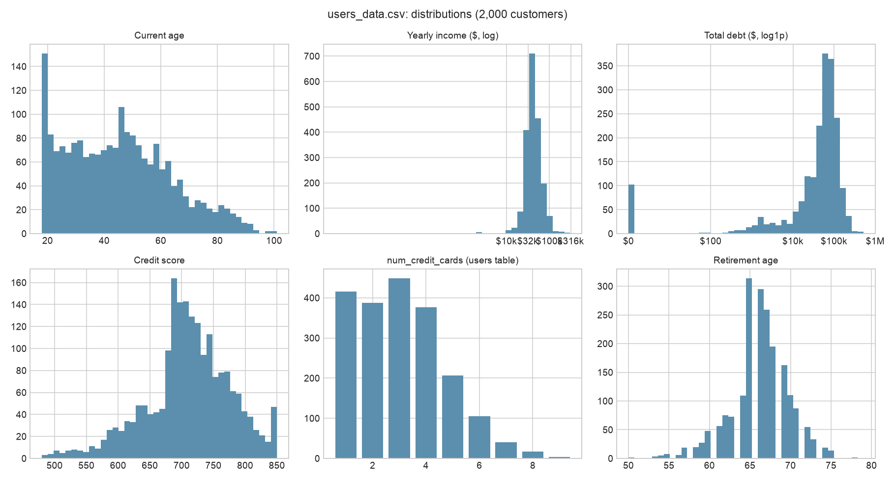
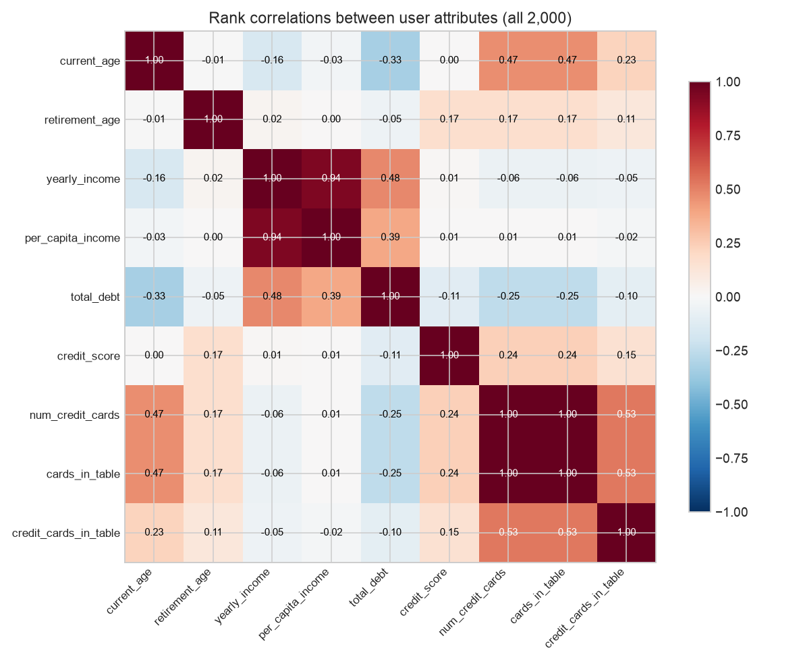
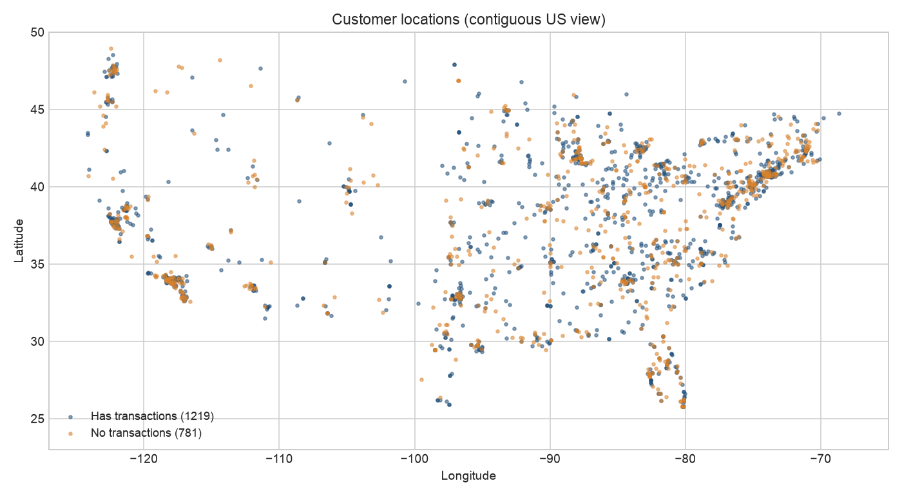
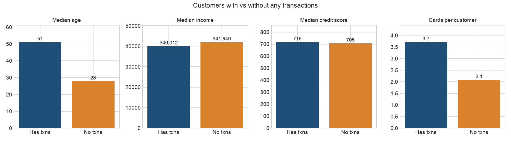
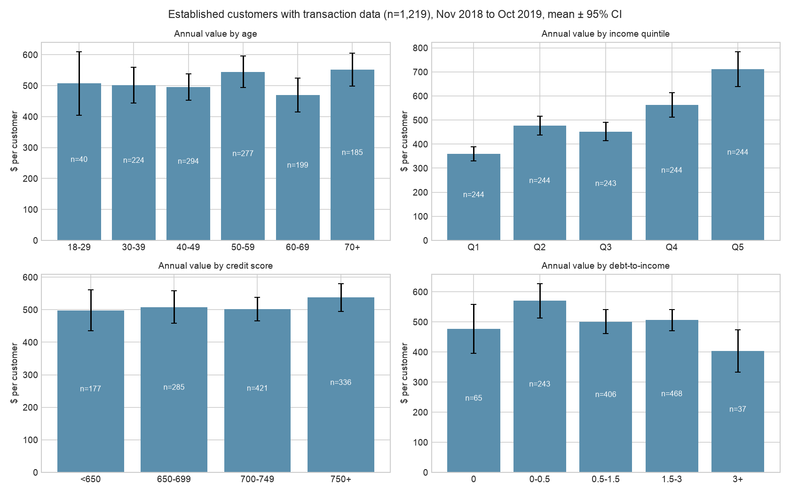

# Deep dive: `users_data.csv`

> **Superseded working notes.** The submitted analysis is the root `README.md`; figures here were not updated and may not match it.

## TL;DR

- **The table is clean but partly synthetic.** It has 2,000 customers, one row each, no nulls and no duplicate IDs. Every customer has at least one card.
- **It's a February 2020 snapshot, taken after the transaction data ends (October 2019).** Age, income, debt and credit score are measured after the period we value customers on. Used as "predictors", they look ahead in time.
- **`yearly_income` isn't personal income.** For 84% of customers it is exactly 2.039 × `per_capita_income`, an area-level figure. The other 16% are mostly retirees (median age 75) on a lower multiple. "Income" really means "how well-off the neighbourhood is."
- **`num_credit_cards` is mislabelled.** It equals the customer's total card count across credit, debit and prepaid in all 2,000 rows. It matches their credit-card count only 10% of the time.
- **Credit score carries almost no signal.** It's uncorrelated with age (0.00), income (0.01) and customer value (0.06).
- **Income is the only attribute here that clearly moves value.** The top income fifth earns $712 a year against $359 for the bottom fifth, mainly because they spend more. Age, credit score, debt and gender barely matter.
- **The table splits into two populations.** 994 customers appear in the marketing data: they have signups and touchpoints, and a median age of 31. The other 1,006 never touch marketing data and have a median age of 51.
- **387 customers joined after the transaction data ends** (from November 2019), with a median age of 22. They have no transactions because there was no time for any. That's not a data gap.

## 1. Structure and data quality

| Check | Result |
|---|---|
| Rows / columns | 2,000 / 14 |
| Nulls | None |
| Duplicate IDs | None. IDs run 0–1999 with no gaps. |
| Money fields stored as text (`$29278`) | Parsed cleanly; 0 failures |
| Zero values | `per_capita_income` = 0 for 15 customers; `total_debt` = 0 for 102 |
| Implausible incomes | 8 customers with `yearly_income` under $1,000, minimum $1. All have `per_capita_income` = 0. |
| Credit score range | 480–850. 34 customers sit exactly at the 850 cap. |
| Age range | 18–101; 21 customers are 90+ |
| Duplicate addresses | 1 pair ("506 Washington Lane") at different coordinates. There's no city field, so they are probably different places. |
| Coordinates | 2 decimal places (about 1 km). 1,531 unique points; 718 customers share a point with someone else. |
| Outside the contiguous US | 12 customers (Alaska and Hawaii) |
| Gender | 1,016 female, 984 male |

**Snapshot date.** `current_age` matches `birth_year` and `birth_month` exactly for every customer if the snapshot is February 2020. No other month fits all rows.

| Column | Min | Median | Max | Notes |
|---|---:|---:|---:|---|
| `current_age` | 18 | 44 | 101 | Spike at 18–19: all 111 are customers acquired in 2020 |
| `retirement_age` | 50 | 66 | 79 | 15% of customers are at or past it |
| `yearly_income` | $1 | $40.7k | $307k | Derived from `per_capita_income` (section 2) |
| `per_capita_income` | $0 | $20.6k | $163k | Area-level |
| `total_debt` | $0 | $58.3k | $516k | 5% have zero debt |
| `credit_score` | 480 | 712 | 850 | Capped at 850 |
| `num_credit_cards` | 1 | 3 | 9 | Actually the total card count (section 2) |

## 2. Fields that don't mean what their names say

**`yearly_income` is derived from area income.**

- For 1,676 customers (84%), `yearly_income / per_capita_income` = 2.039 exactly.
- The other 313 with a ratio outside that band are mostly older:
  - 240 have a lower ratio (median age 76, many at 0.673).
  - 58 have a higher ratio (median age 73).
- Implication: "income" ranks customers by neighbourhood affluence, with an age adjustment for retirees. It is not a verified personal income. Any "higher-income customers are worth more" finding should be read as "customers in better-off areas are worth more."

**`num_credit_cards` counts all cards.**

| Comparison | Agreement |
|---|---:|
| Equals credit-card count in `cards_data` | 10% |
| Equals total card count in `cards_data` (all types) | **100%** |

It's best treated as `num_cards`. Credit-card counts should come from `cards_data`.

**`credit_score` is unrelated to everything else.** Rank correlations are 0.00 with age, 0.01 with income and −0.11 with debt. Real credit scores rise with age and fall with debt. The field looks randomly generated and shouldn't carry weight in any segmentation.

**Relationships that do look real:**
- Debt rises with income (0.48) and falls with age (−0.33).
- Card count rises with age (0.47), because older customers have had longer to collect cards.

## 3. Geography

- Customers spread across the US, clustered in big metro areas: the Bay Area, Los Angeles, the Pacific Northwest, the Northeast corridor, Chicago, Florida and Texas.
- Customers with and without transactions are geographically mixed. Missing transaction data isn't a regional problem.
- `per_capita_income` varies within the same coordinate point for 127 points, so it isn't a pure per-location value even though it behaves like one.
- There is no state or zip field. Region analysis would need reverse geocoding.

## 4. How the users table connects to the other tables

| Link | Customers |
|---|---:|
| Have at least one card in `cards_data` | 2,000 (100%); no orphan cards |
| Have any transactions | 1,219 (61%) |
| Have a signup in `account_signups` | 994 (50%) |
| Have touchpoints in `marketing_touchpoints` | 994. Exactly the same customers as signups. |

**Two populations:**

| | In marketing data (994) | Not in marketing data (1,006) |
|---|---:|---:|
| Median age | 31 | 51 |
| Median income | $42.2k | $39.6k |
| Median credit score | 715 | 708 |
| Cards per customer | 3.1 | 3.1 |

The marketing layer, which is synthetic according to the brief, was attached to a younger half of the customer base.

**Customers with no transactions (781) are two different groups:**

| Group | Customers | Median age | Explanation |
|---|---:|---:|---|
| Joined November 2019 or later | 387 | 22 | Joined after transactions end, so no gap |
| Joined before November 2019, no transactions | 394 (24% of 1,613) | 41 | **A real gap.** Either never activated or missing from the extract. |

Among customers who joined before November 2019, the share with no transactions falls with age:

| Age | 18–29 | 30–39 | 40–49 | 50–59 | 60–69 | 70+ |
|---|---:|---:|---:|---:|---:|---:|
| No transactions | 67% | 32% | 20% | 21% | 14% | 14% |

## 5. Which user attributes relate to customer value?

Based on 1,219 established customers with transaction data, valued from November 2018 to October 2019.

| Attribute | Rank correlation with annual value | With purchase volume |
|---|---:|---:|
| `per_capita_income` | 0.27 | 0.52 |
| `num_credit_cards` (total cards) | 0.27 | 0.13 |
| `yearly_income` | 0.24 | 0.47 |
| `credit_score` | 0.06 | −0.02 |
| `current_age` | 0.06 | 0.04 |
| `total_debt` | 0.05 | 0.13 |
| Debt-to-income | −0.05 | −0.06 |

| Band | Customers | Annual value | Purchase volume | Hold credit today | Premium credit on day one |
|---|---:|---:|---:|---:|---:|
| **Income Q1 (lowest)** | 244 | $359 | $36.0k | 73% | 4% |
| Income Q3 | 243 | $452 | $47.4k | 70% | 12% |
| **Income Q5 (highest)** | 244 | **$712** | $76.2k | 68% | 27% |
| Age 18–29 | 40 | $507 | $51.3k | 55% | 15% |
| Age 70+ | 185 | $552 | $55.1k | 80% | 15% |
| Credit score under 650 | 177 | $498 | $54.0k | 56% | 11% |
| Credit score 750+ | 336 | $537 | $52.4k | 78% | 16% |
| 1 card in total | 98 | $369 | $47.1k | 30% | 11% |
| 6 cards in total | 96 | $651 | $60.3k | 91% | 16% |
| Female | 622 | $518 | $53.6k | 71% | 13% |
| Male | 597 | $507 | $53.0k | 71% | 15% |

What this shows:

- **Income works through spend, not product.** High-income customers spend twice as much, and are 7× as likely to start on Premium credit because limits track income. They're no more likely to hold credit today.
- **Card count rises with value, but it's a consequence of tenure.** Older customers have more cards and more of them are credit. Card count isn't a usable acquisition signal.
- **Age, credit score, debt and gender barely move value.** Age matters only through card count and credit uptake.
- **Every attribute is from February 2020, after the value window.** For example, high debt could result from the spending we measure rather than predict it.

## 6. Implications for the analysis

1. **Describe "income" as area affluence**, not personal income, in Q1 and Q3.
2. **Don't use `num_credit_cards` as a credit-card count.** Use `cards_data`.
3. **Drop credit score as a segmenting variable.** It has no relationship with value or any other field.
4. **Correct the Q1 missing-data wording.**
   - The gap is 394 customers who joined before November 2019, not 781.
   - For under-30s it's 67%, not 92%.
   - The other 387 joined after the data ends.
   - Q1's values are unchanged, because its population already required a card before November 2018.
5. **Treat all user attributes as February 2020 snapshots.** They describe customers but can't be leading indicators for value measured in 2018–2019.
6. **For Q3:** the marketing-linked half of the base is much younger (median 31 vs 51). Channel comparisons will mostly describe that younger group.

## Files

| File | Contents |
|---|---|
| `src/deep_dive_users.py` | Code for everything above |
| `users_deep_dive.json` | All checks and statistics |
| `users_describe.csv` | Column summary statistics |
| `users_enriched.csv` | Users plus card counts and links to other tables |
| `coverage_profiles.csv` | Profiles of customers with and without transactions, signups and touchpoints |
| `plots/` | Five charts referenced above |
