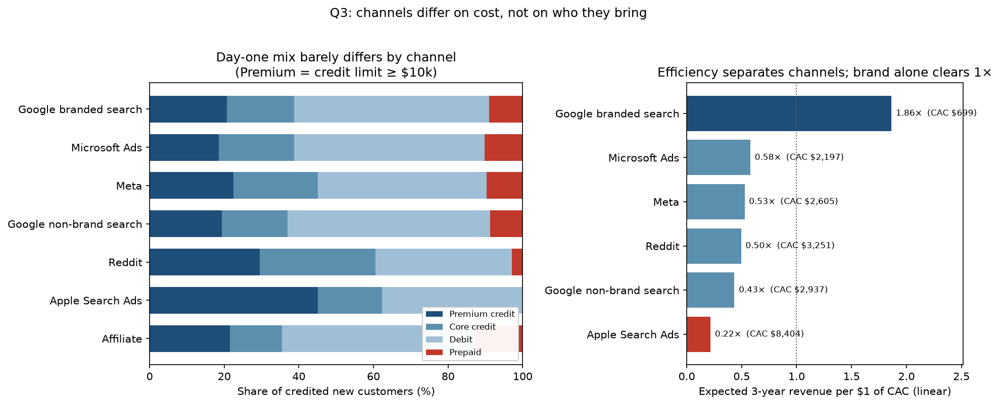

# Q3: Channel quality vs tyre-kickers, and next year's budget

**Headline:** Channels barely differ on *who* they bring. They differ a lot on *what they cost*. Follow our own cost per new customer, not platform CAC. Hold branded search rather than scale it, test growing Microsoft, trim or test non-brand search and Reddit, pause-test Apple before cutting, and don't scale affiliate until commissions are in the spend table.

Sources: `channel_spend` (Apple triplicates removed), `marketing_touchpoints`, `account_signups`, `cards_data`, and the three-year day-one segment values (`Premium credit` / `Core credit` / `Debit` / `Prepaid`). Belief-level detail: [`VP_BELIEFS.md`](VP_BELIEFS.md).

## 1. What "good" and "tyre-kicker" mean

Same rule as Q1 Part 2 and Q2: the highest credit limit on day one, cut at **$10k**. Values are three-year revenue for customers whose first card opened January 2010 – November 2016, priced with Q1's revenue model (prepaid at the debit rate).

| Day-one segment | Role for Q3 | Three-year revenue, with data | If no-data customers are $0 |
|---|---|---:|---:|
| Premium credit (limit ≥ $10k) | **Good** | $2,760 | $1,643 |
| Core credit (limit under $10k) | Worth having | $1,601 | $731 |
| Debit | Average | $793 | $436 |
| Prepaid | **Tyre-kicker** | $330 | $165 |

2020 new customers have no transaction rows, so channel "quality" is the day-one product/limit mix, priced at those historical values. It is not observed lifetime value for this cohort. The ideal definition of a tyre-kicker, someone who never becomes a real customer (Q2), can't be measured for them.

## 2. Quality: mix barely moves

Segment mix among new customers credited to each channel (linear attribution, all acquisition signups with a journey):

| Channel | Premium | Core | Debit | Prepaid | Linear customers | Expected 3yr value |
|---|---:|---:|---:|---:|---:|---:|
| Apple Search Ads | 45% | 17% | 38% | 0% | 8.3 | **$1,819** |
| Reddit | 30% | 31% | 36% | 3% | 11.4 | $1,611 |
| Direct | 24% | 19% | 48% | 8% | 88.7 | $1,381 |
| Meta | 22% | 23% | 45% | 10% | 63.2 | $1,372 |
| Organic search | 17% | 28% | 43% | 12% | 47.6 | $1,304 |
| Google branded search | 21% | 18% | 52% | 9% | 122.6 | $1,303 |
| Google non-brand | 19% | 18% | 54% | 9% | 40.6 | $1,274 |
| Microsoft Ads | 18% | 20% | 51% | 10% | 22.7 | $1,273 |
| Affiliate | 21% | 14% | 52% | **13%** | 35.3 | $1,269 |

- **No paid channel is a tyre-kicker factory.** Prepaid is ~8–10% almost everywhere.
- **Affiliate is slightly worse** (13% prepaid; ~$1,281 expected for affiliate-touched new customers vs ~$1,365 for others). That isn't large enough to drive budget on its own.
- **Apple and Reddit look "better" on mix** (more Premium, less prepaid), but on only ~8–11 linear customers. That's too thin to reallocate toward them.

## 3. Efficiency: this is where channels separate

January–February 2020 only (385 new customers). Expected 3yr value from the mix above ÷ linear CAC:

| Channel | Share of paid spend | Our CAC (linear) | First-touch CAC (95% range) | Expected 3yr value | **Value per $1 CAC** | If no-data customers are $0 |
|---|---:|---:|---:|---:|---:|---:|
| Google branded search | 16% | **$699** | $1,644 ($1,281–$2,291) | $1,303 | **$1.86** | $1.02 |
| Microsoft Ads | 9% | $2,197 | $1,368 ($1,010–$2,020) | $1,273 | $0.58 | $0.31 |
| Meta | 31% | $2,605 | $2,296 ($1,873–$2,966) | $1,372 | $0.53 | $0.29 |
| Reddit | 7% | $3,251 | $2,609 ($1,696–$4,846) | $1,611 | $0.50 | $0.27 |
| Google non-brand | 24% | $2,937 | $1,973 ($1,551–$2,584) | $1,274 | $0.43 | $0.24 |
| Apple Search Ads | 12% | **$8,404** | $2,653 ($1,857–$4,294) | $1,819 | **$0.22** | $0.12 |
| Affiliate | Not recorded | Unknown | — | $1,269 | — | — |

- **Brand is cheapest on linear credit** and the only paid channel near or above $1 of expected three-year revenue per $1 of CAC, on either value basis. That's before rewards and losses.
- **On first touch, Microsoft is cheapest,** but its range overlaps brand's.
- **Apple's better mix doesn't offset an ~$8.4k CAC.**
- **The ranking holds on 2016–2019 too:** brand cheapest, then Microsoft, then Meta, on the 56 new customers from those years. Those costs are $83k+ per customer, which points to incomplete older sign-up records.

## 4. What to do with next year's budget

1. **Don't set budget from platform-reported CAC.** Microsoft's $770 is its own conversion count, which jumps in Jan–Feb 2020 past the number of new customers we have from every channel combined. Detail in [`VP_BELIEFS.md`](VP_BELIEFS.md) belief 1.
2. **Hold Google branded search; don't scale it.** It is the cheapest on our records, but scaling it is a different matter:
   - Doubling it for two weeks in March 2019 bought clicks and no measurable accounts (Q4).
   - It finishes journeys other channels start: last touch for 161 new customers, first touch for 46, and the next touch after an affiliate 97 times.
   - Its volume is capped by people already searching for us.
3. **Test growing Microsoft.** It is second-cheapest on linear credit and level with brand at starting journeys.
4. **Hold Meta and test it with a holdout.** It is the largest line, at a middling cost.
5. **Trim or test Google non-brand and Reddit.** They have the lowest returns after Apple.
6. **Don't grow Apple; test before cutting.** It has the worst paid CAC, and its share of spend is already flat at ~12%. It starts journeys others finish. Fix the triplicate spend rows at source.
7. **Get affiliate commissions into `channel_spend`.** It looks free only because cost is missing. If paid on every touched sign-up, commissions above ~$160 exceed expected three-year revenue. Exclude existing customers' extra cards from payouts. Detail in belief 3.
8. **Move money in steps, each with a holdout.** Spend shares barely moved from 2016 to 2019, so the data can't show what an extra dollar buys in any channel. Attribution ranks exposure, not lift.

## 5. The VP's three beliefs (short verdicts)

| Belief | Verdict |
|---|---|
| Microsoft is most efficient at ~$770 platform CAC | **Number wrong, instinct partly right.** Our CAC is ~$2,200, second to brand; cheapest on first touch |
| Apple is a money pit / spend climbing | **Partly right.** Return is poor; its spend share isn't growing; the file triple-counts it |
| Affiliate is free growth → scale hard | **Wrong as stated.** Cost is missing; about half of touched sign-ups are existing customers |

Full evidence, plots, and sensitivity tables: [`VP_BELIEFS.md`](VP_BELIEFS.md).

## 6. Limits

- Only Jan–Feb 2020 gives usable CAC (385 new customers; earlier years are too thin).
- That window sits inside an unexplained signup surge.
- 2020 quality is priced from the day-one mix, not observed from spending.
- Attribution is exposure, not causation. The log of ad and site visits doesn't rise and fall with spend in any channel (Q4), so read these costs as a ranking, not a price list.
