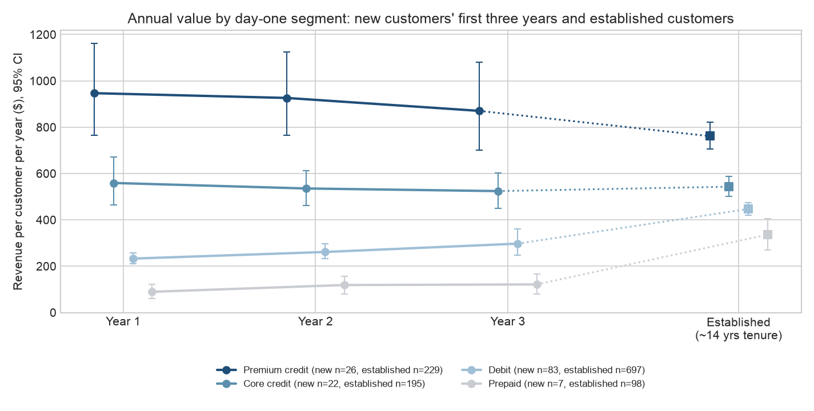
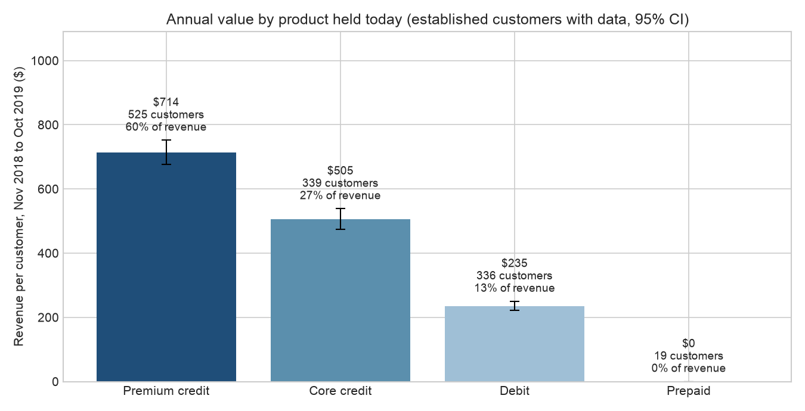
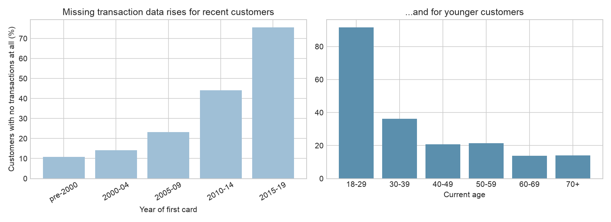

# Q1: Who are our customers, and which segments are worth having?

> **Superseded working notes.** The submitted analysis is the root `README.md`. These notes use an earlier $12k credit cut and figures that were not updated, so they won't match it.

## The one-page answer

**The decision**

1. **Acquire customers on credit cards, and favour high limits.** A customer who starts on a credit card with a $12k+ limit (Premium credit) earns about 3.6× a Debit starter over three years.
2. **Debit and Prepaid are on-ramps. Pay little up front, then move them to credit.** About 30% of either group add a credit card within five years, and those who do earn 2.5–5× more than those who don't.
3. **Find Premium through income, not demographics.** Income separates Premium from Core credit customers well; age, gender and region don't.

**The four segments**, set by the card a customer opens on day one:

| Segment | Who they are | Share of all customers | Year 1 revenue | 3-year revenue (95% CI) | Annual revenue once established | Verdict |
|---|---|---:|---:|---:|---:|---|
| **Premium credit**: credit, limit $12k+ | Affluent: median income $52.7k, 37% in the top income fifth | 14% | $958 | **$2,823** ($2,200–$3,565) | $801 | **Most valuable. Put acquisition money here.** |
| **Core credit**: credit, limit under $12k | Lowest income: median $35.0k, 32% in the bottom fifth | 22% | $608 | $1,727 ($1,464–$1,977) | $566 | **Worth acquiring.** About 60% of Premium. |
| **Debit**: debit, no credit | The broad middle; spends $55.6k a year, between Core and Premium | 55% | $231 | $780 ($687–$886) | $447 | **Worth acquiring at a modest price.** Value grows as they add credit. |
| **Prepaid**: prepaid only | Average incomes; uses the card but it earns $0 under the rate card | 9% | $9 | $81 (7 customers) | $336 | **Pay very little up front.** Moves to credit as often as Debit. |

- **Revenue** is interchange plus Amex annual fees, before any costs.
- **Year 1 and 3-year revenue** come from 138 customers acquired from 2010 to 2018.
- **Established revenue** comes from 1,219 long-standing customers, from November 2018 to October 2019.
- **The three-year revenue is the most we could pay** to acquire a customer and still break even on revenue within three years.

**What could change the answer**

- **Costs.** If rewards and other costs tied to credit spend reach about 1.1% of that spend, Core credit falls to Debit's value; at about 1.5%, so does Premium. Finance's actual cost figure is the single most important missing input.
- **Small samples behind the 3-year values:** 22 Premium, 26 Core, 83 Debit and 7 Prepaid customers. The ranking itself is very stable: it holds in at least 99.7% of resamples, and on all 1,219 established customers.
- **Missing customers.** 24% of customers who joined before November 2019 have no transactions, including two-thirds of under-30s. The segments mostly describe customers aged about 51 today. Counting the missing as $0 lowers every value but keeps the ranking.
- **Prepaid's rate.** At debit rates, Prepaid starters would be worth about 20% more once established.

## 1. How the segments are defined, and why

**Definition.** A customer's segment is set by the cards opened in their first month with us: product type, then total credit limit.

| Rule | Segment |
|---|---|
| A credit card in the first month, with total limit of $12k or more | Premium credit |
| A credit card in the first month, total limit under $12k | Core credit |
| A debit card in the first month, no credit card | Debit |
| Only prepaid in the first month | Prepaid |

The same definition applies to every customer, new or established, so the segments are comparable over time.

**Why product type.** It drives revenue under the rate card, and Growth chooses which product to advertise. A credit dollar earns 1.8¢. A debit dollar earns about 0.05¢ plus 21¢ per purchase. Prepaid earns nothing.

**Why credit limit, even though underwriting sets it.**

- **Limit is the strongest value signal within credit.** First-year revenue on credit cards opened from 2010 to 2018 rises with limit: $295, $324, $390 and $596 across limit quarters.
- **It tracks income closely** (rank correlation 0.59) and barely tracks credit score (0.06).
- **It adds information beyond income.** Within each income third, high-limit cards earned 2.0–2.7 times what low-limit cards earned in their first year:

  | Income third | Low limit | Mid limit | High limit |
  |---|---:|---:|---:|
  | Low | $229 | $364 | $521 |
  | Mid | $257 | $316 | $506 |
  | High | $277 | $392 | $749 |

- **Growth can't target ads on a credit limit.** It chooses which product to sell and which audiences to reach. Section 2 shows that income is what predicts landing in Premium.
- **The limit is known the day we approve a customer,** which makes it a fair day-one quality measure.

**Why the cut is at $12k.** Card-level revenue has a break at about this point. Credit cards with limits under $11k earn about the same in their first year whatever the limit ($306–$339 across limit fifths). Above it, revenue climbs to $426 at $11k–$15k and $624 above $15k, as spending roughly doubles. $12k is also where the share of customers who mostly use credit jumps from about 35% to about 59%. The exact cut isn't optimised, but the break is in the data.

**Why income is a description, not a split.** Income barely moves debit value: $82 to $107 a year per debit card across income quarters. Within credit, the limit already carries most of the income effect.

**Evidence: what moves a card's value.** Every card opened from January 2010 to November 2018 (1,594 cards from 903 customers) was profiled on its first-year revenue against each card and customer attribute. Ranked by effect:

| Attribute | Effect on first-year revenue per card | Used in the segments? |
|---|---|---|
| Card type | Credit $400, debit $97, prepaid $0 | Yes: first split |
| Customer's first card or an extra card | First card about 2×: credit $737 vs $364, debit $202 vs $87 | Yes: segments use the day-one card |
| Credit limit (credit cards) | About $306–$339 below $11k; $426 at $11k–$15k; $624 above $15k | Yes: Premium versus Core |
| Income | Credit cards $232 to $647 across income fifths; debit $77 to $108 | No: works through the limit |
| Age at opening | Under-30s $270, over-70s $143, but mostly because older customers hold more cards (5.7 vs 3.5). With card count held fixed, the gap largely disappears on credit | No |
| Region and state | Northeast $225 to Midwest $162; overlapping intervals; the gap narrows after adjusting for card type | No |
| Brand | Within credit, $348–$400 for Visa, Mastercard and Discover. Amex earns $467, but $95 of that is the annual fee | No |
| Opening year | $139–$205 across 2010–2018, no trend | No |
| Cards held | $486 for one card to $120 for six or more, because spending is split across cards. Not a quality signal | No |

The things Growth controls on day one, which product it sells and to whom, map onto the top drivers. Details: `card_profile/CARD_PROFILE.md`.

## 2. Who is in each segment

**The whole customer base.** All 2,000 customers by day-one segment:

| Day-one segment | All customers | With transaction data | Joined before Nov 2019, no transaction data | Joined Nov 2019 or later | Missing among those who joined earlier |
|---|---:|---:|---:|---:|---:|
| Premium credit | 281 (14%) | 171 | 43 | 67 | 20% |
| Core credit | 441 (22%) | 253 | 96 | 92 | 28% |
| Debit | 1,105 (55%) | 697 | 216 | 192 | 24% |
| Prepaid | 173 (9%) | 98 | 39 | 36 | 28% |
| **Total** | **2,000** | **1,219** | **394** | **387** | **24%** |

**Profile of established customers with transaction data.** Attributes are from the February 2020 customer snapshot.

| | Premium credit | Core credit | Debit | Prepaid | All |
|---|---:|---:|---:|---:|---:|
| Customers | 171 (14%) | 253 (21%) | 697 (57%) | 98 (8%) | 1,219 |
| Annual value | $801 | $566 | $447 | $336 | $512 |
| **Median yearly income** | **$52.7k** | **$35.0k** | $40.0k | $43.0k | $40.0k |
| In top income fifth | **37%** | 2% | 21% | 27% | 20% |
| In bottom income fifth | 6% | **32%** | 22% | 23% | 22% |
| Median day-one credit limit | $15.3k | $8.3k | — | — | |
| Average yearly spend, all cards | $64.3k | $43.0k | $55.6k | $44.6k | $53.3k |
| Median total debt | $64.6k | $43.7k | $54.4k | $54.2k | $52.0k |
| Median cards held | 4 | 3 | 3 | 3 | 3 |
| Hold a credit card now | 100% | 100% | 56% | 53% | 71% |
| Median age at first card | 33 | 35 | 36 | 35 | 35 |
| Female | 49% | 54% | 51% | 47% | 51% |
| Region: South / Midwest / West / Northeast | 35 / 24 / 22 / 19% | 40 / 24 / 23 / 13% | 41 / 22 / 20 / 18% | 38 / 19 / 22 / 20% | 40 / 22 / 21 / 17% |

In plain terms:

- **Premium credit: affluent credit customers.** Highest income, with over a third in the top income fifth. They get the biggest limits and spend the most. They also carry the most debt; whether that means higher credit losses can't be checked with this data.
- **Core credit: lower-income credit customers.** The lowest-income segment, below Debit. Credit still earns about 1.2¢ per dollar spent even at a modest limit, which is why they out-earn Debit.
- **Debit: the broad middle.** Their incomes look like the customer base as a whole, and their spending sits between Core and Premium. They earn less only because debit pays less per dollar.
- **Prepaid: average incomes on a product that earns nothing.** 53% now hold a credit card, and 81% hold debit or credit.

**What doesn't separate the segments:** age at first card (median 33–36 in every segment), gender (47–54% female), region (South largest everywhere) and credit score (712–729).

**Can Growth find Premium customers before approval?** Among all 2,000 customers:

| Income fifth | Customers | Start on credit | Start on Premium | Premium share among credit starters |
|---|---:|---:|---:|---:|
| Bottom | 400 | 35% | 4% | 11% |
| 2nd | 400 | 39% | 6% | 15% |
| 3rd | 400 | 35% | 11% | 31% |
| 4th | 400 | 38% | 22% | 58% |
| Top | 400 | 34% | 28% | 83% |

- **Income decides the limit, not the product.** Every income fifth starts on credit at about the same rate (34–39%). What changes is the limit: 83% of top-fifth credit starters land in Premium, against 11% in the bottom fifth.
- **Income separates Premium from Core well.** On a scale where 0.5 is a coin flip and 1.0 is perfect separation, yearly income scores 0.82 and area per-capita income 0.85. Age (0.47) and credit score (0.54) don't help, and Premium share among credit starters is 36–49% in every region.
- **What Growth can act on:** reach higher-income audiences, for example through areas with higher per-capita income, and sell them credit. That raises the Premium share without asking underwriting to change limits.
- **Caveat:** income is from the February 2020 snapshot, and `yearly_income` is largely derived from area income. Application-time income would confirm this.

## 3. Value over a customer's life

**New customers' first three years.** Customers whose first card opened between 2010 and 2018, with transaction data:

| Day-one segment | Customers | Year 1 (95% CI) | Year 2 | Year 3 | 3-year total (95% CI) |
|---|---:|---:|---:|---:|---:|
| Premium credit | 22 | $958 ($755–$1,220) | $943 | $902 | $2,823 ($2,200–$3,565) |
| Core credit | 26 | $608 ($512–$718) | $579 | $551 | $1,727 ($1,464–$1,977) |
| Debit | 83 | $231 ($210–$255) | $256 | $292 | $780 ($687–$886) |
| Prepaid | 7 | $9 ($0–$19) | $36 | $37 | $81 ($0–$199) |

**Established customers by the card they started on.** Annual value from November 2018 to October 2019:

| Day-one segment | Customers with data | No data | Annual value (95% CI) | Median | Share of revenue | Now hold a credit card |
|---|---:|---:|---:|---:|---:|---:|
| Premium credit | 171 | 40 | $801 ($730–$883) | $698 | 22% | 100% |
| Core credit | 253 | 94 | $566 ($529–$604) | $505 | 23% | 100% |
| Debit | 697 | 212 | $447 ($419–$474) | $341 | 50% | 56% |
| Prepaid | 98 | 38 | $336 ($270–$406) | $236 | 5% | 53% |

What these show:

- **The ranking holds at every stage.** Premium credit leads in year 1, year 3 and once established.
- **Credit value is steady, while Debit and Prepaid grow** as customers move onto credit.
  - Of established customers who started on Debit, 33% now qualify as Premium credit and 23% as Core credit.
  - Of those who started on Prepaid, 81% now hold debit or credit.
- **Debit starters bring in half of today's revenue** because they are 57% of the established base. Most of that revenue now runs through credit cards they added later.
- **Card-level revenue curves agree.** A credit card earns $400 in year 1 and declines about 3% a year, flattening after about eight years; debit runs at $80–$100 a year. Details: `revenue_curves/REVENUE_CURVES.md`.

## 4. How robust is the ranking?

**Resampling.** In bootstrap resamples, each segment out-earns the next one down in at least 99.7% of draws. This holds both for 3-year value (despite the small samples) and for established value:

| Comparison | 3-year value, new customers | Annual value, established customers |
|---|---:|---:|
| Premium > Core | 99.95% | 100% |
| Core > Debit | 100% | 100% |
| Debit > Prepaid | 100% | 99.7% |

**Larger card-level sample.** Across all 513 credit cards opened from 2010 to 2018, not just first cards, cards with limits of $12k+ earn $545 in their first year against $322 for cards under $12k.

**If missing customers are inactive.** Counting customers with no transaction data as $0, established annual value per account becomes Premium $650, Core $413, Debit $343 and Prepaid $242. The ranking holds. Core and Prepaid lose the most because they have the highest missing shares (27–28%). Core's lead over Debit narrows from $119 to $70.

**If customers leave and we can't see it.** The customer file only contains people who were still customers in February 2020, so departures before then are invisible. If customers left at a steady rate each year, 3-year value would be:

| Annual churn | Premium credit | Core credit | Debit | Prepaid |
|---:|---:|---:|---:|---:|
| 0% (as measured) | $2,823 | $1,727 | $780 | $81 |
| 5% | $2,687 | $1,645 | $739 | $76 |
| 10% | $2,556 | $1,565 | $699 | $70 |
| 15% | $2,429 | $1,488 | $661 | $65 |

Every segment falls by about the same proportion, so the ranking doesn't change. The established values, which build up over many more years, are more exposed: treat them as an upper bound.

## 5. Value after costs, and what we can afford to pay

The rate card only gives revenue. The biggest costs on a credit card, rewards and credit losses, scale roughly with credit spend. This table subtracts a cost equal to a share of each customer's credit spend:

| Cost, % of credit spend | Premium credit: 3-year | Core credit: 3-year | Debit: 3-year | Prepaid: 3-year | Premium / Core / Debit / Prepaid, established annual |
|---:|---:|---:|---:|---:|---|
| 0% (revenue only) | $2,823 | $1,727 | $780 | $81 | $801 / $566 / $447 / $336 |
| 0.5% | $2,086 | $1,270 | $741 | $81 | $623 / $446 / $380 / $273 |
| 1.0% | $1,349 | $814 | $702 | $81 | $444 / $326 / $313 / $210 |
| 1.5% | $612 | $357 | $663 | $81 | $265 / $205 / $246 / $147 |

- **Credit revenue is almost all spend-linked:** 90% of Premium's and nearly all of Core's 3-year revenue is credit interchange, against about 20% for Debit starters. Costs on credit spend therefore hit the credit segments hardest.
- **The ranking holds up to about 1.1% of credit spend.** Above that, Core credit falls to Debit's 3-year value. Premium falls to Debit at about 1.5%. Premium stays above Core at any cost level.
- **The maximum we can afford to pay** to acquire a customer, breaking even within three years, is the 3-year figure at our true cost rate. At 1%, that is about $1,350 for Premium, $810 for Core, $700 for Debit and under $100 for Prepaid.
- **This is the number to get from Finance.** Card rewards commonly cost in the region of 1% of spend or more, which is exactly where the ranking starts to move. Revolving interest, which isn't in the data, would push the other way for credit.

## 6. How value is created: the product held today

Grouping established customers by what they hold now, rather than what they started on, shows where revenue comes from today:

| Held today | Customers with data | Annual value (95% CI) | Share of revenue | Share of top 10% | Average yearly spend | Revenue per $100 spent |
|---|---:|---:|---:|---:|---:|---:|
| Premium credit | 552 (45%) | $697 ($661–$733) | 62% | 80% | $58.1k | $1.20 |
| Core credit | 312 (26%) | $517 ($480–$555) | 26% | 20% | $45.2k | $1.14 |
| Debit | 336 (28%) | $235 ($221–$250) | 13% | 0% | $55.2k | $0.43 |
| Prepaid | 19 (2%) | $0 | 0% | 0% | $14.0k | $0.00 |

- **Customers who hold only debit today spend almost as much as Premium credit holders** ($55.2k against $58.1k a year). The value gap is the rate card, not shopping behaviour. These spend figures differ from section 2 because the grouping is by product held today, not day-one card.
- **This view is not the right one for acquisition decisions.** "Held today" is partly a result of how long someone has been a customer. Premium credit holders average 1.9 credit cards, and only about a third hold just one. That's why the headline uses day-one segments.
- **Value is spread fairly evenly.** The top 10% of customers, those earning $971 or more, bring in 27% of revenue. All of them hold credit today.
- **The segments overlap.** The best Core credit customers (90th percentile $902) out-earn the median Premium credit customer ($608).
- **The activation pocket is small.** 87 credit holders spend actively but put nothing on their credit card. They average $258 a year, against $681 for credit holders who use their card. Converting all of them would add about $37k a year, so it's worth a cheap nudge, not a strategy.

## 7. Debit and Prepaid as on-ramps to credit

All customers who started on Debit (1,105) or Prepaid (173), using card open dates:

| | Debit starters | Prepaid starters |
|---|---:|---:|
| Added a credit card within 1 year | 8% | 6% |
| Within 3 years | 19% | 18% |
| Within 5 years | 29% | 30% |
| Within 10 years | 47% | 46% |
| Median years to first credit card, if added | 4.3 | 3.8 |
| Established annual value, added credit | $611 (388 customers) | $545 (52) |
| Established annual value, no credit | $240 (309) | $100 (46) |

- **Prepaid converts to credit as often and as fast as Debit.** Its weak 3-year value ($81) comes from 7 customers, five of whom never left prepaid. On the full group it is an on-ramp, not a dead end.
- **The upgrade is where the value is.** Debit starters who add credit earn 2.5× those who don't; Prepaid starters 5×.
- **Most upgrades come late:** only 8% in year 1 and 19% by year 3. That is the case for a structured early cross-sell test.
- Rates within N years only include customers who had been with us at least N years by February 2020.

## 8. Who opens new cards: new versus existing customers

Each card opening is classed as **new customer** if it falls in the customer's first month with us, or **existing customer** if they already had a card from an earlier month.

| Years | Cards opened | By existing customers | By new customers |
|---|---:|---:|---:|
| 1991–1999 | 170 | 13 (8%) | 157 |
| 2000–2009 | 2,795 | 1,623 (58%) | 1,172 |
| 2010–2015 | 1,593 | 1,355 (85%) | 238 |
| 2016–2019 | 410 | 354 (86%) | 56 |
| 2020 (Jan–Feb only) | 1,178 | 635 (54%) | 543 (385 customers) |

- **Most cards since 2010 have gone to existing customers.** New-customer cards fell from about 140 a year in 2004–2008 to about 14 a year in 2016–2019.
- **Part of this trend is built into the data.** The customer file is a February 2020 snapshot, so customers who left before then are missing. Read the split as a description of today's base, not a true history of acquisition.

**Is an extra card new revenue?** For 1,043 extra cards opened between 2011 and 2018, I compared the customer's total revenue in the 12 months before and after. I subtracted the change seen over the same months among customers who opened no card.

| Extra card | Cards | Revenue on the new card itself | Change in customer's total revenue (95% CI) | Genuinely new |
|---|---:|---:|---:|---:|
| Credit | 308 | $351 | **+$189** (+$153 to +$226) | 54% |
| Debit | 650 | $85 | −$1 (−$11 to +$8) | ~0% |
| Prepaid | 85 | $0 | −$53 (−$77 to −$30) | Negative |

- **An extra credit card is real growth.** About half its revenue is new; the rest is spend moved over from the customer's other cards.
- **An extra debit or prepaid card is not growth.** Counting these as acquisitions overstates growth.

**New customers over time, like for like.** Day-one segment of each newly acquired customer:

| Day-one segment | New customers 2010–2018 (282) | New customers Jan–Feb 2020 (385) |
|---|---:|---:|
| Premium credit | 12% | 17% |
| Core credit | 25% | 24% |
| Debit | 57% | 50% |
| Prepaid | 6% | 9% |
| **Expected year-1 value** | **$395** | **$426** |
| **Expected 3-year value** | **$1,210** | **$1,294** |

- **Early-2020 customers are slightly better on day one.** There are more Premium and fewer Debit, offset a little by more Prepaid.
- **Card openings jumped from about 7 a month in 2019 to about 590 a month.** A jump of roughly 80× in two months points to a data artifact, such as a backfill or a change in how accounts are recorded. It needs explaining before anyone relies on 2020 volumes.
- **Transactions end in October 2019,** so none of these customers have observed spend. Their values are estimates from earlier cohorts.

## 9. Customers with no transaction data

- **781 of 2,000 customers have no transactions anywhere from 2010 to 2019, but only 394 of them are a real gap.** The other 387 joined in November 2019 or later, after the data ends. The 394 are 24% of the 1,613 customers who joined before November 2019.
- **It looks like missing data, not behaviour.**
  - Customers in the transaction file used every card they opened from 2010 to 2018 in its first year, so absence is all or nothing rather than card by card.
  - Among customers who joined before November 2019, it rises steeply for younger and more recent customers: 67% of 18–29-year-olds against 14% of over-60s, and 11% of pre-2000 customers against 76% of 2015–2019 customers.
- **The data can't rule out genuine never-activation.**

**What this does to the findings:**
- **Who the segments describe.** Under-30s are 8% of customers who joined before November 2019 but 3% of the customers we can see, so they are badly under-represented.
- **How values are calculated.** Missing customers are excluded from every value and counted per segment.
- **How the ranking would change.** If missing means inactive, Core and Prepaid lose the most (27–28% missing, against 23% for Debit and 19% for Premium). The ranking holds; section 4 has the numbers.

## 10. How sensitive are the values to the revenue model?

Annual value of established customers by day-one segment:

| Day-one segment | Base case | Money transfers earn no interchange | Prepaid paid at debit rates |
|---|---:|---:|---:|
| Premium credit | $801 | $735 (−8%) | $814 |
| Core credit | $566 | $521 (−8%) | $580 |
| Debit | $447 | $414 (−7%) | $458 |
| Prepaid | $336 | $298 (−11%) | $402 |

- **Money transfer is the largest spend category** at 8% of purchase dollars, and issuers often earn little interchange on it. Setting it to zero cuts values by 7–11%.
- **Neither test changes the ranking.** Costs on credit spend can (section 5).
- **Fraud doesn't change it either.** Labelled fraud is 0.2–0.6% of purchase dollars in every segment, and it isn't netted from value.

## 11. What they buy

Every active segment has the same everyday basket. Gas, grocery, wholesale clubs, food stores and pharmacies are 31–33% of purchase dollars in each, and money transfer is 8%. Merchant category does not separate the segments, so it isn't used to define them.

## 12. Leading indicators versus consequences

| Signal | Known when? | Use |
|---|---|---|
| Product on day one | At approval | Segment definition; Growth chooses what to sell |
| Credit limit granted | At approval, set by underwriting | Segment definition; correlation with value, not proven cause |
| Income (area or applicant) | Before or at application | Predicts Premium versus Core; usable for targeting |
| Credit score, debt | February 2020 snapshot | Weak; barely related to value |
| Product held today, number of cards | After years of tenure | Partly a result of tenure; describes value, doesn't predict it |
| Share of spend on credit, purchase volume | Same period as revenue | Consequence of value; can't predict it |

## 13. Actions and the tests needed

| Segment | Action | What would prove it |
|---|---|---|
| Premium credit | Put acquisition money here. Reach higher-income audiences and sell them credit. | 3-year value of each acquisition cohort, compared with its cost per new customer |
| Core credit | Acquire. Test limit increases. | Randomised limit-increase test on a sample of Core customers |
| Debit | Acquire at a modest price; cross-sell credit early. An extra credit card adds about +$189 a year. | Early credit cross-sell with a holdout group, measuring time to first credit card |
| Prepaid | Pay very little up front; treat as an on-ramp to credit. | Confirm prepaid interchange with Finance; cross-sell test like Debit |
| Existing customers | Report extra debit or prepaid cards separately from acquisitions. | Split new and existing customers in acquisition KPIs |
| Activation pocket (87 customers, about $37k a year) | Low-cost nudge to use the credit card they hold. | Nudge with a holdout group |

## What to instrument

1. **Cost per dollar of credit spend** (rewards, credit losses, servicing) from Finance, to turn section 5 from a range into an answer.
2. **Transactions for every account,** or an explicit "activated / never activated" flag, so the 394 customers with no transactions can be classified.
3. **Application records:** stated income, approved limit, and declined applications.
4. **A new-or-existing customer flag on every account opening,** carried into acquisition reporting.
5. **An explanation of the January–February 2020 surge in card openings** from the team that owns the accounts feed.
6. **Revolving balances,** so "worth having" can include interest income.

## Assumptions and limitations (Q1)

- **Data used:** `users_data`, `cards_data`, `transactions_data`, `mcc_codes`, `train_fraud_labels` and the Finance rate card.
- **Value is revenue, not profit.** It is interchange at the Finance rate card plus Amex $95 fees. Revolving interest is excluded because there is no balance data, and costs are excluded because there is no cost data. Section 5 shows how much costs could move the answer.
- **Prepaid earns $0** because the rate card doesn't cover it.
- **Customers with no transaction data are excluded** from values. The segments describe customers with a median age of about 51 today.
- **Established-customer values only include customers who stayed.** They are an upper bound on what a newly acquired customer will become.
- **The new-customer samples are small:** 22, 26, 83 and 7 customers. The ranking is stable (section 4); the exact values are not.
- **Limits are snapshots in `cards_data`.** Limit changes over time aren't visible.
- **Income, age, debt and credit score are a February 2020 snapshot,** taken after the value window. `yearly_income` is 2.039 × area per-capita income for 84% of customers, so it measures neighbourhood affluence, not personal income. Credit score is unrelated to any other field. See `analysis/deep_dives/users/USERS_DEEP_DIVE.md`.
- **The extra-card estimate is a before/after comparison** against customers who opened no card, not an experiment.
- **Card open dates are month-precision.** 309 of 13.3M transactions fall before their card's open month and were left in.
- **The $12k limit cut isn't optimised.** It matches a break in card-level revenue at about $11k–$12k, but a nearby cut would work as well.
- **The cost sensitivity assumes costs scale with credit spend.** Fixed per-account costs would lower every segment by the same dollar amount and hit Prepaid and Debit hardest in relative terms.

## Artifacts

| File | Contents |
|---|---|
| `v3/card_month.csv` | Spend per card per month, 2010-01 to 2019-10 (from `src/build_card_month.py`) |
| `v3/segment_value_day_one.csv`, `v3/segment_value.csv`, `v3/day_one_to_held_today.csv` | Established customers by day-one segment and by product held today, plus migration between them |
| `v3/new_customer_value.csv`, `v3/new_customer_value_ci.csv`, `v3/card_first_year_value.csv` | New-customer and new-card value by year, with confidence intervals |
| `v3/segment_counts_all_customers.csv`, `v3/segment_profiles.csv` | All 2,000 customers by segment and data status; who is in each segment |
| `v3/premium_rate_by_income_fifth.csv`, `v3/premium_rate_by_age_band.csv`, `v3/premium_rate_by_region.csv` | Premium share by attribute |
| `v3/segment_value_net_of_costs.csv`, `v3/segment_value_churn_scenarios.csv`, `v3/robustness_notes.json` | Cost sensitivity, churn scenarios, rank stability, predictability scores |
| `v3/on_ramp_debit_prepaid.csv` | Time to first credit card for Debit and Prepaid starters |
| `v3/additional_card_incrementality.csv`, `v3/additional_card_events.csv` | Revenue added by extra cards |
| `v3/card_openings_new_vs_existing.csv`, `v3/new_customer_mix_over_time.csv` | Card openings by year; day-one mix of new customers |
| `v3/segments_notes.json`, `v3/cohort_notes.json` | Reconciliation, missing-data coverage, credit-limit checks, activation pocket |
| `card_profile/CARD_PROFILE.md`, `revenue_curves/REVENUE_CURVES.md` | Card-level profiles and revenue curves |
| `src/q1_revenue.py`, `src/q1_v3_cohorts.py`, `src/q1_v3_segments.py`, `src/q1_segment_profiles.py`, `src/q1_v3_robustness.py`, `src/q1_card_first_year_profile.py`, `src/q1_card_revenue_curves.py` | Code |
| `tests/test_q1_revenue.py`, `tests/test_q1_segments.py`, `tests/test_q1_card_profile.py`, `tests/test_q1_card_revenue_curves.py`, `tests/test_q1_robustness.py` | Tests |
