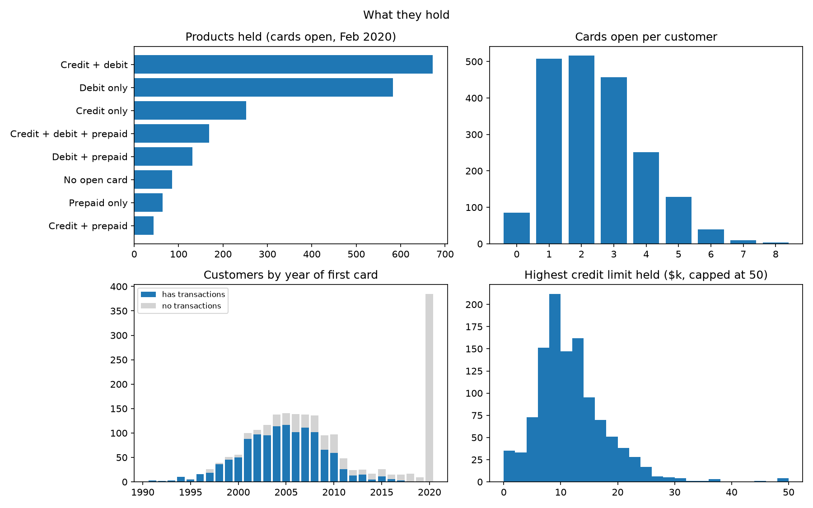
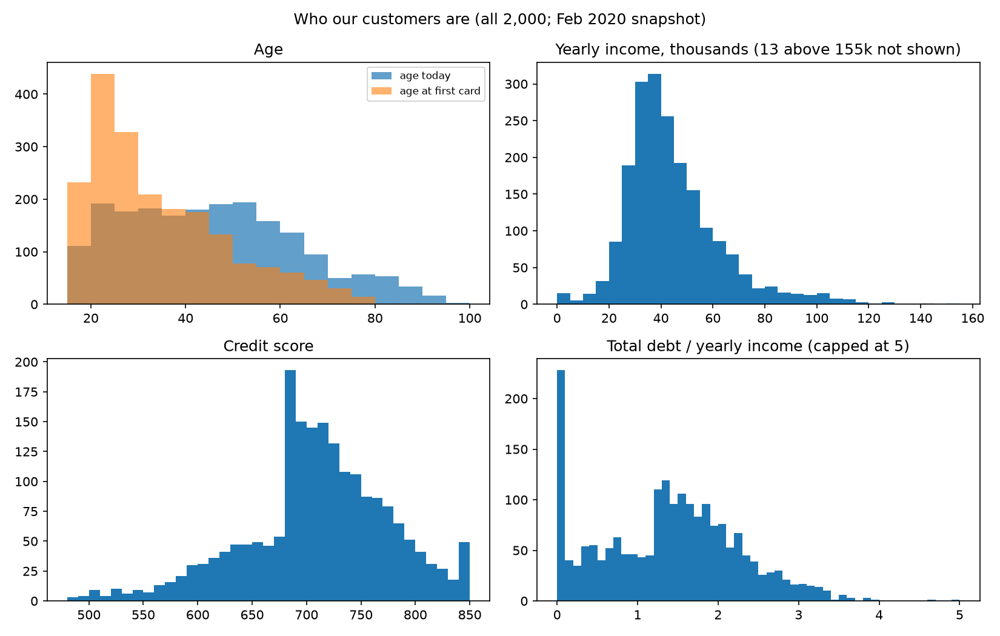
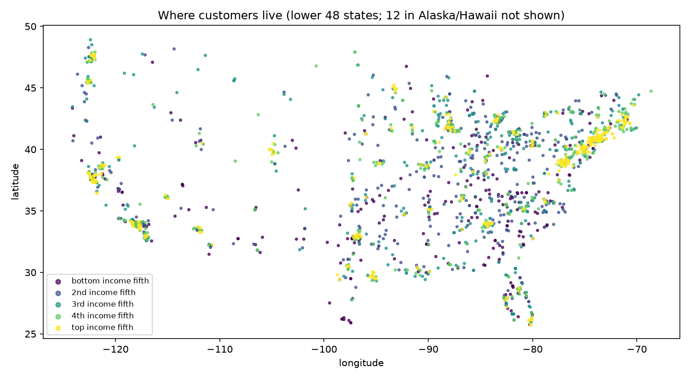
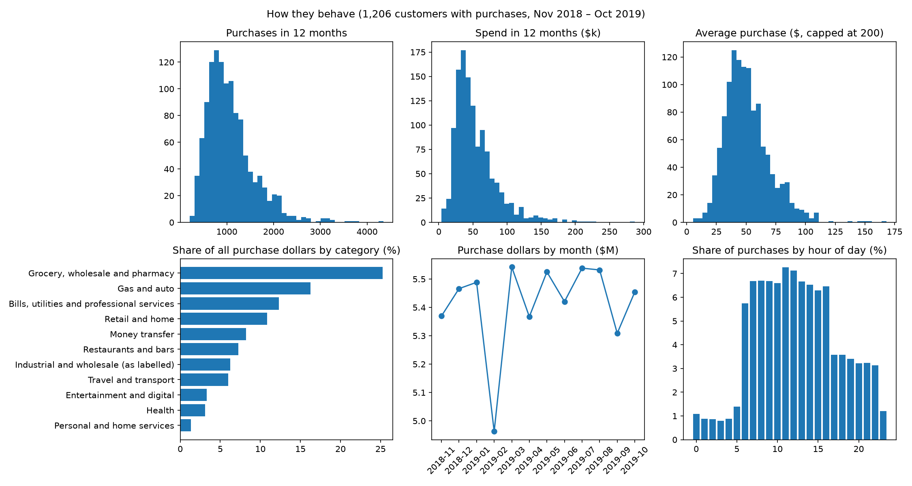
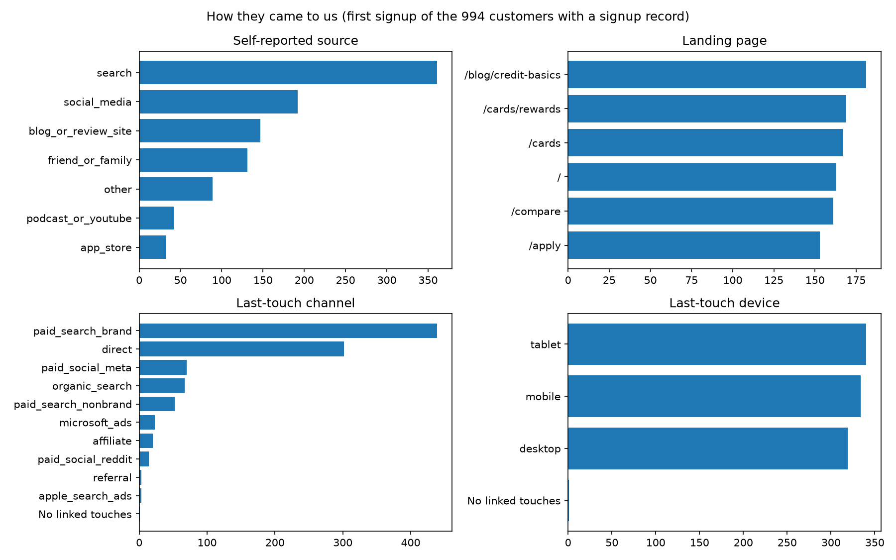
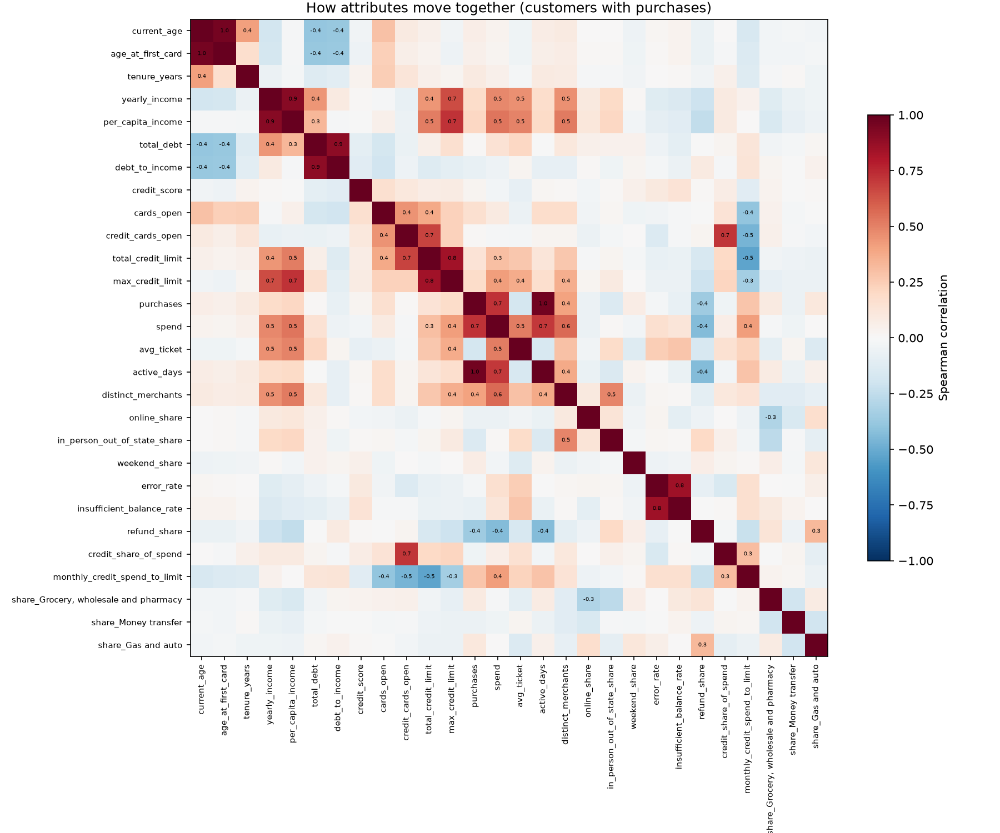

# Q1 Part 1: Who our customers are

A descriptive profile of the customer base: who customers are, what they hold, how they behave, how they came to us, how these attributes relate, and the natural groups they fall into. Revenue is not used here; that is Part 2.

**Populations used throughout**
- **All 2,000 customers** for demographics, finances, tenure and holdings. The customer file is a February 2020 snapshot.
- **The 1,206 customers with at least one settled purchase from November 2018 to October 2019** for behaviour. A settled purchase has a positive amount and no error.
- **The 994 customers with a signup record** for acquisition fields.

## The short version

1. **The customers we can observe are an older, long-standing base.**
   - Median age 44, with 12.8 years since their first card at the median.
   - Two-thirds joined before 2010.
   - The 387 customers who joined from November 2019 onward are much younger, with a median age of 22. They have no transactions yet.
2. **Most hold more than one card, and the main split is credit or no credit.**
   - 57% hold a credit card, 78% a debit card and 20% a prepaid card.
   - The largest groups are credit + debit (34%) and debit only (29%).
3. **Income mainly measures where customers live.** `yearly_income` is exactly 2.04 × area per-capita income for 84% of customers. Median income is $40.7k, highest in the Northeast ($49.3k) and lowest in the South ($38.0k).
4. **Income sets credit limits, not whether someone holds credit.**
   - Every income fifth holds credit at a similar rate, 54–60%.
   - The highest limit held rises from $7.4k in the bottom fifth to $18.9k in the top.
5. **Active customers use their cards every day, in a very even way.**
   - Median of 978 purchases a year (2.7 a day) and $45.9k of spend.
   - 99.6% buy in all 12 months.
   - Weekday shares, monthly totals and the November–December share are all close to even.
   - Activity and timing therefore barely separate customers.
6. **They buy everyday essentials.** Groceries, wholesale clubs and pharmacies are 25% of dollars, gas and auto 16%, and bills and utilities 12%. This is the main spend category for 54% of customers. Payment is mostly chip (69%), with online at 14%.
7. **Declines are near-universal, but small.** 98.8% of active customers had at least one insufficient-balance decline in the year, but declines are only 1.4% of attempts at the median.
8. **Credit score and age describe almost nothing else.**
   - Credit score's strongest correlation with any other attribute is 0.16.
   - Age mainly tracks debt: debt-to-income falls from about 1.55 under 60 to 0.09 at 70+.
9. **Four personas emerge, defined mostly by product and life stage.**
   - Younger credit users (34% of active customers)
   - Debit-only everyday spenders (31%)
   - Established multi-card households (28%)
   - A small group of heavy toll-road drivers (7%)

   The clusters are stable but not sharp.

## 0. What the data covers, and who is missing

**Behaviour only covers 61% of customers.** 1,219 of the 2,000 have any transactions from January 2010 to October 2019, and 1,206 have purchases in the latest 12 months. The missing customers are mostly young and recent:

| Group | Customers | Share with any transactions |
|---|---:|---:|
| Aged 18–29 today | 480 | **8%** |
| Aged 30–39 | 351 | 64% |
| Aged 40–69 | 954 | 79–86% |
| Aged 70+ | 215 | 86% |
| Joined before 2010 | 1,322 | 82% |
| Joined 2010–2017 | 267 | 52% |
| Joined 2018 – Oct 2019 | 24 | **0%** |
| Joined Nov 2019 – Feb 2020 | 387 | **0%** (after the data ends) |
| Under 5 years since first card | 464 | **4%** |
| 20+ years since first card | 171 | 88% |

- **Coverage barely varies by income** (56–68% across income fifths), **region** (59–63%) or **gender** (61%).
- **By product, coverage is lowest where new customers are concentrated.** Credit only is 44%, and prepaid only is 31%.
- **What this means:** every behavioural figure below describes customers who have been with us for years. It says little about customers under 30 or anyone acquired since 2018.

## 1. The base: when customers joined and how long they've stayed

| Joined | Customers | Share |
|---|---:|---:|
| Before 2010 | 1,322 | 66% |
| 2010–2017 | 267 | 13% |
| 2018 – Oct 2019 | 24 | 1% |
| Nov 2019 – Feb 2020 | 387 | 19% |

- **Tenure** (years since first card, at February 2020): the median is 12.8 years; 23% are under 5 years and 9% are 20+.
- **Card openings rose to 545 in 2010, fell to about 90–120 a year in 2016–2019, then jumped to 1,178 in January–February 2020.** An 80× jump in two months looks like a data artifact, such as a backfill, rather than real demand.
- **The 2020 joiners are a different population.**
  - Median age 22, against 52 for customers who joined before 2010.
  - Product mix: 39% debit only, 19% credit only, 22% credit + debit, and 7% prepaid only.

## 2. Who they are: demographics and finances

### Age and life stage

| | Median | 10th–90th percentile | Range |
|---|---:|---|---|
| Age today | 44 | 22–71 | 18–101 |
| Age at first card | 30 | 19–56 | 17–91 |

- **Age today:** 18–29 is 24%, 30–39 18%, 40–49 19%, 50–59 18%, 60–69 12% and 70+ 11%.
- **Most got their first card young.** 33% were 18–24, and 18 customers (1%) were 17. None of those 18 has transaction data.
- **14% are past their stated retirement age.** The median retirement age is 66.
- **Birth decade** spans the 1910s to the 2000s, evenly spread from the 1960s to the 1990s at 17–19% each.

### Gender
51% female, 49% male.

### Location

- **Coverage:** customers live in all 50 states and DC. One customer's coordinates land just across the Mexican border and can't be placed.
- **By region:** South 39%, West 22%, Midwest 22%, Northeast 18%.
- **Top states:** California 12.2%, Texas 7.9%, Florida 6.6%, New York 6.2%, Illinois 4.4%. Customers cluster in metro areas.
- **Affluence differs by region:**

| Region | Median income | In the top income fifth | In the bottom income fifth |
|---|---:|---:|---:|
| Northeast | $49.3k | 33% | 11% |
| West | $42.2k | 22% | 21% |
| Midwest | $39.8k | 15% | 17% |
| South | $38.0k | 16% | 25% |

- **Validation:** the state derived from coordinates matches each customer's main in-person merchant state for 99.6% of customers.

### Income

- **Distribution:** median yearly income is $40.7k, with the 10th–90th percentile range $26.8k–$68.8k and a maximum of $307k.
- **It's mostly area income.** For 84% of customers, `yearly_income` is exactly 2.04 × the area's per-capita income (median $20.6k). Read it as neighbourhood affluence, not personal earnings.
- **Odd values:** 8 customers report under $1,000, and 15 have $0 area income.

### Debt and credit

- **Total debt:** median $58.3k. 102 customers (5%) have none.
- **Debt-to-income:** median 1.42, with a 90th percentile of 2.48. It's flat at about 1.55 below age 60, then falls to 1.11 at 60–69 and 0.09 at 70+.
- **Credit score:** median 712, with a 10th–90th percentile range of 620–792. By band: under 580 is 4%, 580–669 17%, 670–739 47%, 740–799 24% and 800+ 8%.
- **The scores have odd shapes.**
  - 193 customers fall in 680–689, against 54 in 670–679.
  - 34 sit at the 850 maximum.
  - The median barely moves with age (708–715).
- **`num_credit_cards` is mislabelled.** It equals the customer's total number of cards of every type in the cards file, for all 2,000 customers. Its median is 3, with a range of 1–9.

## 3. What they hold

**Cards in the file:**
- 6,146 cards: 3,511 debit (57%), 2,057 credit (33%) and 578 prepaid (9%).
- Brands: Mastercard 3,209, Visa 2,326, Amex 402 and Discover 209. All Amex and Discover cards are credit.
- Status: 4,902 were open in February 2020, and 1,244 had expired. Cards stop transacting at expiry.

**Products held by customers, February 2020:**

| Products held | Customers | Share |
|---|---:|---:|
| Credit + debit | 672 | 33.6% |
| Debit only | 583 | 29.2% |
| Credit only | 252 | 12.6% |
| Credit + debit + prepaid | 169 | 8.5% |
| Debit + prepaid | 131 | 6.6% |
| No open card | 85 | 4.2% |
| Prepaid only | 64 | 3.2% |
| Credit + prepaid | 44 | 2.2% |

- **Cards per customer.** A median of 3 cards ever, of which 2 are open.
  - Open cards: 0 for 4%, 1 for 25%, 2 for 26%, 3 for 23%, 4 for 13%, 5 for 6% and 6+ for 3%.
  - 45% have at least one expired card.
- **Brands held:**

  | Brands held | Share |
  |---|---:|
  | Several brands, no Amex | 40% |
  | Mastercard only | 26% |
  | Any Amex | 15% |
  | Visa only | 15% |
  | Discover only | 1% |

- **Credit limits:**
  - **Per credit card:** median $10.1k, with a 10th–90th percentile range of $4.6k–$18.8k and a maximum of $98.1k. 26 cards have a $0 limit.
  - **Per customer holding credit:** the highest limit held has a median of $10.7k, and the total across their credit cards $13.2k. That's 0.29× yearly income at the median.
- **Limits scale with income.**
  - The median highest limit rises from $7.4k in the bottom income fifth to $18.9k in the top.
  - Limit as a share of income stays flat, at 0.28–0.33×, across fifths.
  - In the top fifth, 38% hold a limit of $15k or more; in the bottom fifth, 2% do.
- **The "credit limit" on debit and prepaid cards isn't a credit line.** It has a median of $16.5k on debit and $65 on prepaid, and what it means is unclear.
- **Other card fields:**
  - open cards average 9.3 years old at the median
  - 89% of cards have a chip
  - 51% were issued once and 48% twice
  - PINs were last changed a median of 6.7 years ago
  - **no card is flagged on the dark web**, so that field is empty

**How holdings vary:**
- **With tenure.** 47% of customers with under 5 years hold one card. 23% of those with 20+ years hold five or more.
- **With age.** Older customers hold more products.
  - Customers 70+: 42% hold credit + debit, 19% hold all three, 4% hold credit only, and none have no open card.
  - Customers 18–29: 35% hold debit only and 18% credit only.
- **With credit score.** Under 580, 47% hold debit only. At 800+, 39% hold credit + debit and 14% hold all three.
- **Not with income.** The share holding credit is 54–60% in every income fifth.

## 4. How they behave (Nov 2018 – Oct 2019, 1,206 customers with purchases)

**Overall:**
- 1.30 million settled purchases worth $65.0M.
- $6.9M of refunds.
- 1.39 million attempts, 22,286 of them declined or errored (1.6%).

### Activity

| Per customer | Median | 10th–90th percentile |
|---|---:|---|
| Purchases a year | 978 (2.7 a day) | 547–1,762 |
| Spend a year | $45.9k | $24.5k–$92.2k |
| Average purchase | $48 | $30–$77 |
| Median purchase | $30 | $11–$60 |
| Days with a purchase | 349 of 365 | 279–364 |
| Distinct merchants | 94 | 67–125 |

- **These customers are daily users.**
  - 99.6% buy in all 12 months.
  - The median gap between purchase days is 1 day.
  - Almost everyone's last purchase falls on the window's final day; the longest gap is 35 days.
- **There's no dormancy to describe inside the active base.** Recency and frequency don't separate customers.
- **Spend is concentrated in a few merchants.** The top merchant takes 11% of a customer's spend at the median, and the top five take 36%.

### Payment method
- **By dollars:** chip 69%, swipe 17%, online 14%.
- **Online share per customer:** median 12%, with a 90th percentile of 25%.

### What they buy

| Category | Share of all purchase dollars | Main category for |
|---|---:|---:|
| Grocery, wholesale and pharmacy | 25% | 54% of customers |
| Gas and auto | 16% | 11% |
| Bills, utilities and professional services | 12% | 14% |
| Retail and home | 11% | 1% |
| Money transfer | 8% | 6% |
| Restaurants and bars | 7% | 7% |
| Industrial and wholesale (as labelled) | 6% | 1.5% |
| Travel and transport | 6% | 4% |
| Entertainment and digital | 3% | 1% |
| Health | 3% | 0.5% |
| Personal and home services | 1% | — |

The "industrial" category covers merchant codes that `mcc_codes.json` labels as manufacturing, such as "Steelworks". In standard coding these numbers are airline, hotel and car-rental codes, so they're kept apart rather than guessed at.

### Where they spend
- **Out of state:** at the median, 13% of in-person spend is outside the customer's home state, across 8 states.
- **Abroad:** 44% of customers made at least one purchase abroad, but abroad is only 1.2% of in-person dollars. The top countries by transactions are Italy, Mexico, Canada, the UK, Japan and China.

### When they spend
- **No weekday or seasonal pattern.**
  - Each weekday carries 13–15% of purchases, and the weekend share is 29%, close to the even-spread 2/7.
  - November–December is 16.6% of spend, close to the even-spread 2/12.
  - Monthly spend runs $5.3–5.5M; February is lower only because it's shorter.
- **A clear daily pattern.** Purchases run at about 6–7% an hour from 6:00 to 17:00, then about 3% an hour in the evening and about 1% overnight. For the median customer, 39% of purchases are in the morning, 36% in the afternoon, 14% in the evening and 3% at night.

### Friction and refunds
- **Declines are rare per attempt.**
  - At the median, 1.4% of a customer's attempts fail.
  - 0.8% fail for insufficient balance, 0.4% for a bad PIN, CVV, card number, expiry or ZIP, and 0.2% for technical glitches.
- **But nearly everyone hits one.** 98.8% had at least one insufficient-balance decline in the year.
- **Refunds and reversals are a median 10% of purchase dollars** (90th percentile 19%). Most are at service stations and food stores, and two-thirds exactly cancel an earlier purchase. That looks like released pre-authorisation holds.

### How they use credit
- 65% of active customers hold a credit card.
- 36% of active customers put nothing on credit, and 10% put everything on credit. At the median, 48% of spend goes on credit.
- **Credit spend against limit:** monthly credit spend is a median 16% of total credit limit (90th percentile 46%). This is spend, not an outstanding balance, which isn't in the data.
- **Cards in use:** customers use every card they hold. Their main card takes a median 52% of spend.

## 5. How they came to us (994 customers with a signup record)

**Read this section with care.**
- 64% of first signups are from 2020.
- 56% of first signups are an existing customer adding a card. Only 44% are a genuinely new customer.
- Because the 2020 signups dominate, these customers are much younger: 36–49% are aged 18–29, whatever the source.

**The signups:**
- **Signup year:** 2020 is 64%; 2016, 2017, 2018 and 2019 are 12%, 9%, 8% and 7%.
- **Signups per customer:** 1 for 60%, 2 for 27%, 3 for 9%, and 4+ for 5%.

| | Breakdown |
|---|---|
| Self-reported source | search 36%, social media 19%, blog or review site 15%, friend or family 13%, other 9%, podcast or YouTube 4%, app store 3% |
| Landing page | evenly split, 15–18% each across `/blog/credit-basics`, `/cards/rewards`, `/cards`, `/`, `/compare` and `/apply` |
| Last-touch channel | branded search 44%, direct 30%, Meta 7%, organic search 7%, non-brand search 5%, Microsoft 2%, affiliate 2%, Reddit 1% |
| First-touch channel | affiliate 19%, Meta 16%, branded search 14%, organic search 13%, non-brand search 12%, Microsoft 8%, direct 7%, Apple 5%, Reddit 4% |
| Last-touch device | tablet 34%, mobile 34%, desktop 32% |

- **Journeys:** a median of 4 touches across 3 channels over 25 days, and never more than 46 days.
- **Customers start on paid and affiliate channels and finish on branded search or direct.**
- **New versus existing customer share is similar in every main channel,** at 41–51% new.
- **Source barely relates to income.** Every source draws from all income fifths. Podcast/YouTube has the most top-fifth customers (31%), but it's only 42 people.
- **The even splits look synthetic.** Landing pages and devices split almost exactly evenly, which is unusual for real traffic.

## 6. How attributes relate

These are Spearman correlations across the 1,206 active customers.

**Mechanical or near-duplicate pairs:**
- purchases and days active: 0.97
- age today and age at first card: 0.96, because tenure varies little among active customers
- income and area income: 0.91
- debt and debt-to-income: 0.89
- error rate and insufficient-balance rate: 0.85
- total and highest credit limit: 0.84

**Substantive relationships:**
- **Area income predicts credit limits and spend better than personal income does.** Area income correlates with the highest limit at 0.72 and with spend at 0.54. For personal income, the figures are 0.65 and 0.48.
- **Credit cards held drive the share of spend on credit (0.72).** Whether a customer uses credit depends on holding it, not on demographics.
- **Bigger spenders use more merchants (0.57).** Customers with more merchants spend more out of state (0.49), which looks like travel.
- **Older customers carry less debt.** Age correlates −0.39 with debt and −0.38 with debt-to-income, and 0.41 with tenure.
- **Refund share falls as spend rises (−0.44).**
- **Credit score is independent of everything.** Its strongest correlation is 0.16, with cards held. **Weekend share and online share** are also nearly unrelated to other attributes.

## 7. Personas: the natural groups

**How to read the chart.** Each row is a persona: P1 younger credit users, P2 debit-only everyday spenders, P3 established multi-card households, P4 toll-road drivers. Each column is one of the 19 traits used to form the groups. Each cell shows how far that persona's average is from the average active customer, in standard deviations: red is above average, blue below, white about average. For example, P4 scores +2.6 on online share and on gas and auto share (toll payments are made online), and P2 scores −1.3 on credit limit (they hold no credit card). The "(log)" columns use the logarithm of the value, which stops a few very large values from dominating.

**Method.**
- The 1,206 active customers were clustered with k-means on 19 standardised features:
  - profile: age, income, debt-to-income, credit score and tenure
  - holdings: cards open, credit limit and credit share of spend
  - behaviour: purchases, average purchase, online share, merchants, out-of-state share and decline rate
  - spending mix: shares in five categories
- Each solution from 2 to 8 clusters was scored on separation (silhouette) and on stability. Stability is agreement with solutions refitted on 20 bootstrap resamples, measured by the adjusted Rand index.
- **Separation is weak for every cluster count** (silhouette 0.10–0.12). The base doesn't fall into crisp natural groups.
- So the choice is **the most detailed solution that stays stable**: four clusters, with agreement 0.80 and no cluster under 50. Three clusters (agreement 0.88) largely merges P1 and P3 into a single credit-holder group.

| Persona | Customers | What sets them apart | Typical customer (medians) |
|---|---:|---|---|
| **P1: Younger credit users** | 407 (34%) | Nearly all hold credit (99.5%): 62% credit + debit, 23% credit only. They're the youngest group, with the lowest income and the most debt relative to income. | Age 44, first card at 29. Income $37.8k, debt-to-income 1.62. 3 cards, $12.4k total limit. 780 purchases, $35.6k spend, 55% on credit. Bills are 16% of spend. Only 11% are in the top income fifth. |
| **P2: Debit-only everyday spenders** | 375 (31%) | 98% hold no credit card: 72% debit only, 21% debit + prepaid, 5% prepaid only. Otherwise average. | Age 50. Income $41.4k, spread evenly across income fifths. 2 cards. 918 purchases, $43.5k spend, nothing on credit. |
| **P3: Established multi-card households** | 338 (28%) | Older and long-standing, with the most cards and the highest limits. They carry little debt and have the best credit scores. | Age 63, with 37% aged 70+. First card at 45, 17 years' tenure. 4 cards: 64% credit + debit, 25% all three. $17.4k total limit. Debt $21.5k, debt-to-income 0.58, credit score 731. 1,202 purchases, $58.6k spend, 107 merchants. 27% are in the top income fifth. |
| **P4: Toll-road drivers** | 86 (7%) | 39% of their spend is online, and 41% is gas and auto. | 31.5% of their dollars go on online toll and bridge fees: about 600 payments each a year, averaging $38. They have the most purchases (1,522), the highest spend ($70.8k) and the smallest average purchase ($42). 48% live in the South. 59% hold credit. |

**Shares of active customers' spend:** P1 26%, P2 30%, P3 34%, P4 10%. This is spend, not revenue.

**What doesn't separate the personas:**
- gender (46–54% female)
- region, except P4's tilt to the South
- the main spend category, which is groceries for 57–60% of P1–P3
- the decline rate (1.4–1.6%)
- the share of spend out of state (12–13%)

**Clustering on behaviour alone,** without profile and holdings, is unstable: agreement is 0.43–0.48 for three or four clusters. Only two behavioural groups recur in every solution: the toll-road drivers, and a small group whose spending is dominated by money transfers.

## 8. Data quirks found along the way

- **The customer file is a February 2020 snapshot.** Ages match that month for every customer, and income, debt and credit score are presumably taken at the same time. Customers who left before then aren't in the file.
- **There are no transactions for 781 customers.**
  - 387 joined after the data ends in October 2019.
  - The other 394 joined earlier and are mostly young and recent. That looks like missing data rather than behaviour.
  - No customer whose first card opened after October 2017 has any transactions.
- **`yearly_income` is 2.04 × area per-capita income for 84% of customers.** 15 customers have $0 area income, and 8 report under $1,000 of yearly income.
- **`num_credit_cards` counts every card,** not just credit cards.
- **Credit limits on debit and prepaid cards aren't credit lines.** The medians are $16.5k and $65.
- **`card_on_dark_web` is "No" for every card.**
- **Credit scores clump.** 193 sit at 680–689, against 54 at 670–679, and 34 at the 850 maximum.
- **Merchant codes 3000–3999 are labelled as manufacturing** in `mcc_codes.json`, unlike standard coding.
- **Card openings jump 80× in January–February 2020,** an unexplained surge.
- **Landing pages and devices split almost exactly evenly** across their values.
- **Activity is uniform:** daily purchasing, no seasonality and no weekday pattern. That fits a simulated transaction feed more than real card behaviour.

## Files

| File | Contents |
|---|---|
| `part1_customers.csv` | One row per customer: every attribute, behaviour feature and persona |
| `part1_coverage.csv` | Share with transactions by age, join period, tenure, region, income, score, product, gender |
| `part1_attribute_stats.csv`, `part1_attribute_distributions.csv` | Summary statistics and group counts for demographics, finances and holdings |
| `part1_behaviour_stats.csv`, `part1_behaviour_distributions.csv` | Summary statistics and group counts for behaviour |
| `part1_acquisition_distributions.csv`, `part1_acquisition_journey_stats.csv` | Source, landing page, channel, device, signup year; journey length |
| `part1_correlations.csv`, `part1_strongest_correlations.csv` | Spearman correlation matrix and the strongest pairs |
| `part1_crosstabs.csv` | Income × products and limits, age × products, region × income, tenure × cards, score × products, source × age and income, channel × new or existing |
| `part1_persona_*.csv` | Cluster-count selection (with and without profile features), persona medians, standardised means and mixes |
| `part1_summary.json` | Card-level tables, overall behaviour mixes, persona descriptions |
| `src/q1_part1_profile.py`, `tests/test_q1_part1_profile.py` | Code and tests |
