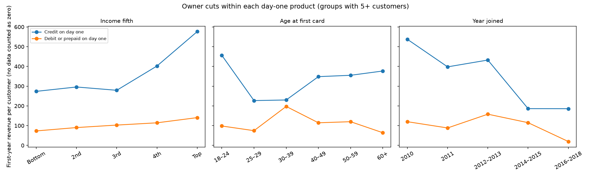

# Q1 Part 2: Which segments are worth having, judged on first-year revenue

> **Technical backup.** The README now uses only customers with transaction records and compares groups with plain averages (`simple_*` outputs from `src/q1_simple_profile.py`). This document keeps the original statistical rating of every cut. Its headline figures count customers without transaction records as $0; use the "with data" figures to match the README.

Each customer cut from Part 1 is rated on how much revenue a customer brings in **their first year with us**.

**How first-year revenue is measured:**
- **Customers:** the 282 whose first card opened between January 2010 and November 2018, so a full first year is observed before the data ends in October 2019.
- **Revenue:** the step 2 model on every card the customer holds in months 1–12, where month 1 is the first-card month. That's interchange net of refunds, with prepaid at the debit rate, plus the Amex fee pro-rated by months open. There's no revolving interest and no costs.
- **Headline:** customers with no transaction data count as $0. Every group also shows the mean among customers with data, as a sensitivity.

## The short version

1. **The product a customer opens on day one is the strongest and most dependable cut.**
   - Credit starters earn about three times what debit starters do: $358 against $115 in the headline, or $769 against $223 among customers with data.
   - Prepaid starters earn least.
   - The order holds in 100% of resamples.
2. **Among credit starters, a higher day-one limit means more first-year revenue.** Limits of $10k or more earn about $480–$530, against about $160–$250 under $10k. Among customers with data that's about $890–$905 against $545–$565.
   - The groups are small, so neighbouring limit bands often swap places in resamples.
   - The split at $10k is clear, but the finer ordering isn't.
3. **Brand matters only through product.** Amex and Discover are credit-only, which is why they rank high. Within credit, and within debit, brand doesn't separate revenue.
4. **Once product is known, the owner's demographics barely move first-year revenue.**
   - Higher income and area income point the right way, but not significantly within each product.
   - Age at first card, region, gender and debt-to-income show nothing.
   - Credit score is uneven rather than rising.
5. **Acquisition fields don't separate first-year revenue.** For this cohort, they mostly describe a later signup rather than how the customer first joined.
6. **What separates value most among customers with data is behaviour measured years later:** persona, how much they spend today, and what they hold today. These describe value after the fact. They can't be used to pick customers at acquisition.
7. **Three months in, the best early signal appears.**
   - Revenue in a customer's first 90 days predicts their revenue in months 4–12 almost perfectly, with a Spearman correlation of 0.93.
   - First-90-days spend predicts it well within each product: 0.91 for credit and 0.71 for debit or prepaid.
8. **Counting missing customers as $0 halves the values, and it creates one false pattern.**
   - The average falls from $406 to $198.
   - The data gap is similar across products, so product rankings hold.
   - It's much larger for recent joiners, so "year joined" looks like falling value when it's mostly missing data.

## 1. The cohort

| Joined | Customers | With transaction data |
|---|---:|---:|
| 2010 | 97 | 59 (61%) |
| 2011 | 48 | 26 (54%) |
| 2012–2013 | 49 | 28 (57%) |
| 2014–2015 | 43 | 16 (37%) |
| 2016–2018 | 45 | 9 (20%) |
| **Total** | **282** | **138 (49%)** |

- **The data gap grows over time.** No customer whose first card opened after October 2017 appears in the transaction file, so all 15 who joined in 2018 count as $0.
- **First-year revenue:** $198 per customer in the headline (95% CI $159–$238), or $406 among customers with data ($347–$473).
- **Revenue is concentrated.** The top 10% of customers bring in half of it.

## 2. How each cut is rated

For each group:
- number of customers, and how many have data
- mean first-year revenue with a 95% bootstrap interval
- median, and an index against the average customer
- share of the cohort's first-year revenue

For each dimension:
- **variance explained, net of chance:** the share of variance the groups explain, minus what random groups of the same sizes would explain
- **a permutation p-value**
- **the share of resamples that keep the order of groups** with 10 or more customers

Each dimension is also tagged by when it's known:
- **Day one:** from the cards opened in the customer's first month.
- **Snapshot:** the February 2020 customer file. It's roughly known at acquisition, but measured later.
- **At signup:** only for customers with a signup record.
- **Consequence:** measured from November 2018 to October 2019, years after the first year. These are rated on customers with data.

| Dimension | When known | Customers | Variance explained, net of chance | p | Among customers with data |
|---|---|---:|---:|---:|---:|
| Highest credit limit on day one | Day one | 282 | **21.8%** | 0.001 | 64.0% |
| Product on day one | Day one | 282 | **12.6%** | 0.001 | 46.9% |
| Brand on day one | Day one | 282 | 7.3% | 0.002 | 26.1% |
| Year joined | Day one | 282 | 1.9% | 0.05 | −0.8% (p 0.58) |
| Area income fifth | Snapshot | 282 | 1.7% | 0.06 | 4.6% (p 0.04) |
| Income fifth | Snapshot | 282 | 0.6% | 0.24 | 3.2% (p 0.08) |
| Credit score | Snapshot | 282 | 0.5% | 0.25 | 8.3% (p 0.004) |
| Last-touch channel | At signup | 177 | 0.6% | 0.31 | −0.9% |
| Region, gender, debt-to-income, age at first card | Day one / snapshot | 282 | about 0% | 0.56–0.84 | ≤ 1.8% |
| Self-reported source, landing page | At signup | 177 | about 0% | 0.49–0.60 | about 0% |
| Persona | Consequence | 136 | 19.2% | 0.001 | |
| Spend fifth, 2019 | Consequence | 136 | 11.0% | 0.002 | |
| Products held, Feb 2020 | Consequence | 282 | 8.1% | 0.004 | 22.0% |
| Online-share fifth, 2019 | Consequence | 136 | 2.9% | 0.10 | |
| Main spend category, 2019 | Consequence | 136 | 2.2% | 0.20 | |

**Counting missing customers as $0 shrinks every separation.** Roughly half of every group is $0 whatever its true value. The column "among customers with data" shows how strongly each cut separates customers we can actually observe.

## 3. What customers open on day one

| Day-one product | Customers (with data) | First-year revenue (95% CI) | Index | Share of first-year revenue | Among customers with data |
|---|---:|---:|---:|---:|---:|
| Credit | 103 (48) | **$358** ($265–$458) | 1.81 | 66% | $769 ($650–$904) |
| Debit | 161 (83) | **$115** ($95–$135) | 0.58 | 33% | $223 ($202–$245) |
| Prepaid | 18 (7) | **$33** ($12–$58) | 0.16 | 1% | $84 ($57–$116) |

| Highest credit limit on day one | Customers (with data) | First-year revenue | Among customers with data |
|---|---:|---:|---:|
| No credit card | 179 (90) | $107 | $212 |
| Under $5k | 17 (5) | $160 | $543 |
| $5–10k | 39 (17) | $246 | $564 |
| $10–15k | 33 (18) | $483 | $886 |
| $15–25k | 12 (7) | $528 | $905 |
| $25k+ | 2 (1) | $1,163 | $2,325 |

- **Credit on day one is where first-year revenue comes from.** Credit starters are 37% of new customers and bring in 66% of first-year revenue.
- **The data gap is similar across products,** at 47% with data for credit, 52% for debit and 39% for prepaid. So the $0s shrink the gaps without reordering them.
- **A day-one limit of $10k or more is the clearest dividing line within credit.** Below it, credit starters with data earn about $550; above it, about $890.
  - Groups above $15k are too small to rank: 12 customers at $15–25k and 2 at $25k+.
  - Neighbouring bands swap order in most resamples (order kept in 35%).
- **Brand reflects product:**
  - Amex: $489 (20 customers). Discover: $479 (9).
  - Mastercard: $168 (143). Visa: $163 (110).
  - Within credit starters, brand doesn't separate revenue (p 0.23). Among debit starters, Visa and Mastercard are identical (p 0.65).
- **Opening more than one card in the first month** happened for one customer, so it can't be rated.

## 4. Who the owner is, within each product

Rated across all products, owner attributes barely separate first-year revenue. Rated within each day-one product, so they aren't just reflecting product:

| Cut | Pattern | Within credit | Within debit or prepaid |
|---|---|---|---|
| Income fifth | Rises with income. Credit starters: $274 (bottom) to $576 (top). Debit starters: $73 to $141. | not significant (p 0.39) | not significant (p 0.26) |
| Area income fifth | Similar rise. Credit: $249 to $576. | p 0.22 | p 0.17 |
| Age at first card | No pattern. Credit 18–24 earn $456; debit 30–39 earn $197. | p 0.62 | p 0.06 |
| Credit score | Uneven. Credit 740–799 earn $551; credit 580–669 earn $377. | p 0.24 | p 0.14 |
| Region | Northeast highest for credit ($453), West for debit ($136) | p 0.69 | p 0.26 |
| Year joined | Falls over time in both products. This is mostly missing data: only 20% of 2016–2018 joiners have data. | p 0.05 | p 0.001 |

**Across all products** (headline, then among customers with data):

- **Income:**
  - bottom fifth: $122 / $251
  - 4th fifth: $251 / $546
  - top fifth: $252 / $461
- **Area income:** bottom fifth $130 / $249; 4th fifth $284 / $568.
- **Credit score.** The 580–669 band is highest among customers with data ($719, 19 customers), and 800+ is lowest ($285, 8 customers). There's no sensible ordering, so I read the score as noise.
- **Debt-to-income:** $120 to $220 across bands (p 0.78).
- **Gender:** male $204, female $193 (p 0.77).
- **Region:** $166–$235 (p 0.56).

**The direction on income is consistent.** Higher-income and higher-area-income customers earn more in both products. But with 103 credit and 179 debit-or-prepaid starters, half of them at $0, the difference isn't statistically reliable. A larger cohort, or application-time income, would be needed to confirm it.

## 5. How they came to us

177 of the cohort have a signup record.
- Their first record dates from 2016 or later.
- So for customers who joined from 2010 to 2015, the recorded source, landing page and channel belong to a later card, not the first one.
- None of these fields separates first-year revenue (p 0.31–0.60).

The figures, for completeness:

| Field | Groups and first-year revenue |
|---|---|
| Source | search $210 (61 customers), social media $222 (33), blog or review $133 (33), friend or family $157 (29), podcast or YouTube $391 (8) |
| Last-touch channel | branded search $264 (82), direct $113 (57) |

## 6. Consequences: behaviour and holdings measured later

These separate first-year revenue among customers with data, but they're measured in 2018–2019 or February 2020. That's years after the first year for most of the cohort. They describe value; they can't predict it at acquisition.

- **Personas** (136 customers active in 2018–19):

  | Persona | Customers | First-year revenue (95% CI) |
  |---|---:|---:|
  | Younger credit users | 68 | $560 ($461–$677) |
  | Toll-road drivers | 13 | $444 ($290–$634) |
  | Debit-only everyday spenders | 52 | $184 ($165–$205) |
  | Established multi-card households | 3 | too few to read; this persona mostly joined before 2010 |

- **Spend in 2018–19:** first-year revenue rises from $197 for the bottom fifth to $614 for the top.
- **Products held in February 2020** (among customers with data):

  | Products held | First-year revenue | Customers |
  |---|---:|---:|
  | Credit only | $690 | 23 |
  | Credit + debit | $532 | 41 |
  | Debit only | $211 | 45 |
  | Debit + prepaid | $166 | 12 |

- **Main spend category and online share** don't separate reliably (p 0.10–0.20).

## 7. The early signal: the first 90 days

For the 138 customers with data:

| Fifth of spend in the first 90 days | Median spend in 90 days | Revenue in months 4–12 |
|---|---:|---:|
| Bottom | $4.4k | $147 |
| 2nd | $7.6k | $235 |
| 3rd | $10.5k | $304 |
| 4th | $14.0k | $341 |
| Top | $21.1k | $498 |

- **First-90-days revenue predicts months 4–12 revenue almost perfectly** (Spearman 0.93). Early revenue already reflects the product mix and how much the customer spends.
- **First-90-days spend predicts it strongly within each product:** 0.91 for credit and 0.71 for debit or prepaid.
- **Across products it's weaker (0.45),** because debit customers spend as much as credit customers but earn far less on it.
- **What this means:** day one tells us the product. Three months later, the customer's early revenue tells us most of their first year.

## 8. Caveats

- **Counting customers without data as $0 was a deliberate choice for the headline,** but it's a strong one. 144 of the 282 customers have no transactions at all, which looks like missing data rather than inactivity. It halves every value, and it creates the false decline by year joined. Values among customers with data are shown throughout.
- **The samples are small:** 282 customers, 138 with data. That's only 48 credit starters with data, and 14 with a limit of $15k or more.
- **The customer file only includes people still customers in February 2020.** Values are conditional on staying.
- **Income, credit score and region are February 2020 values,** not values at application.
- **Revenue is before costs and excludes revolving interest.** Rewards and credit losses would cut into the credit segments' lead.

## Files

| File | Contents |
|---|---|
| `part2_customers.csv` | One row per cohort customer: first-year revenue (headline and with data), every cut, early-signal measures |
| `part2_segment_value.csv` | Every cut and group: customers, with data, first-year revenue with 95% CI, median, index, share, value among customers with data |
| `part2_dimension_ranking.csv` | Variance explained net of chance, permutation p, ranking stability, headline and among customers with data |
| `part2_within_product.csv` | Owner cuts rated within credit and within debit-or-prepaid starters |
| `part2_early_signal.csv`, `part2_summary.json` | First-90-days spend fifths and correlations; cohort totals |
| `src/q1_part2_value.py`, `tests/test_q1_part2_value.py` | Code and tests |
